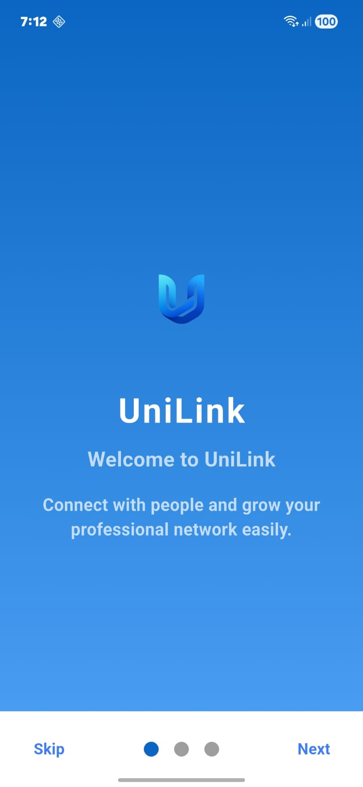
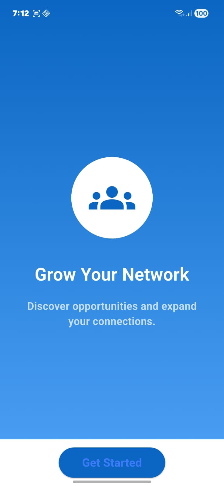
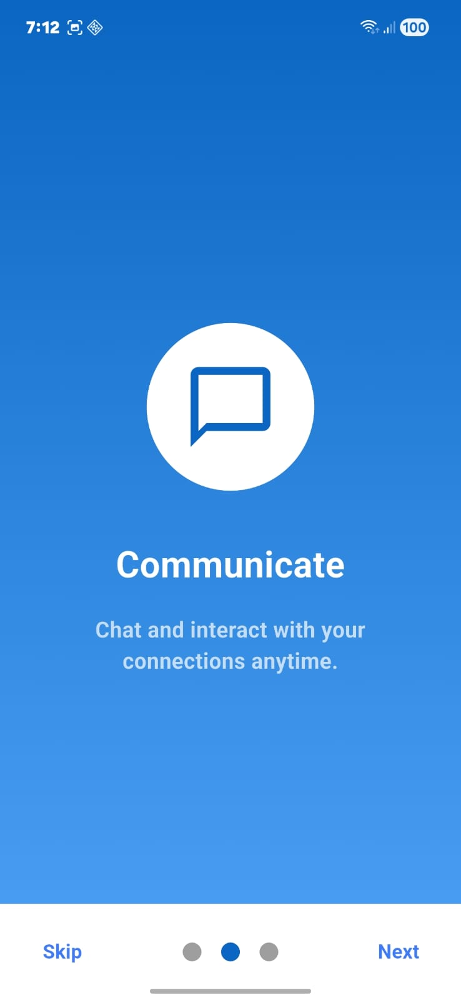
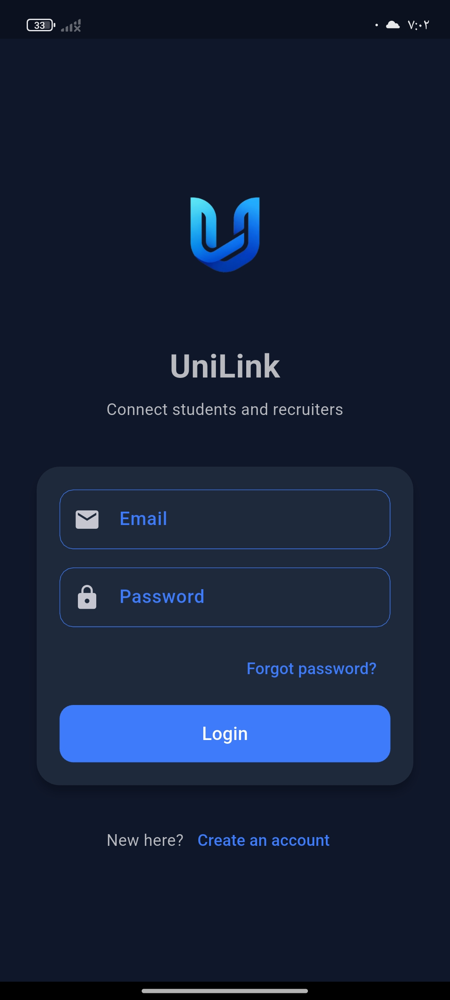
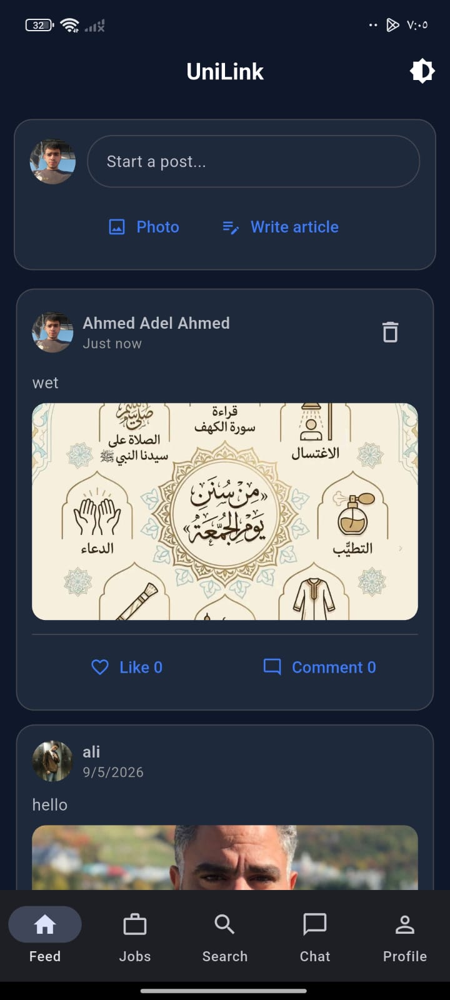
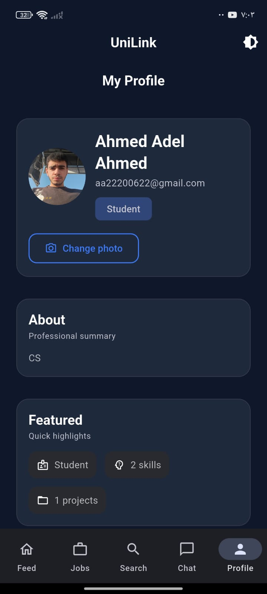
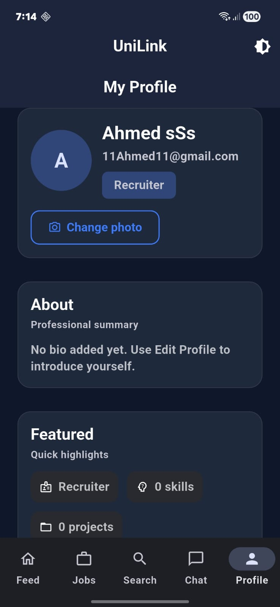

<div align="center">

<br/>

<!-- Logo Placeholder -->


<br/><br/>

# UniLink

### *Bridging Education & Career Opportunities*

<br/>

[](https://flutter.dev)
[](https://dart.dev)
[](https://firebase.google.com)
[](https://flutter.dev)
[](https://github.com)
[](LICENSE)

<br/>

> **UniLink** is a modern cross-platform mobile application that connects **students** and **recruiters** — making professional networking faster, smarter, and more accessible than ever.

<br/>

[📱 Features](#-features) · [🛠️ Tech Stack](#%EF%B8%8F-tech-stack) · [🚀 Getting Started](#-getting-started) · [🗺️ Roadmap](#%EF%B8%8F-roadmap) · [🤝 Contributing](#-contributing)

<br/>

---

</div>

<br/>

## 📌 Overview

The gap between education and the job market has never been more visible. Students struggle to get noticed. Recruiters struggle to find the right talent. **UniLink was built to solve exactly that.**

UniLink is a **Flutter-based mobile application** that provides a dedicated, clean, and professional platform for students to showcase themselves and for recruiters to discover top talent — all in one seamless experience.

Whether you're a **student** looking for your first opportunity or a **recruiter** hunting for the next great hire, UniLink is your bridge.

<br/>

---

## ✨ Features

### 🔐 Authentication System
- Secure **Sign Up & Login** flows built on Firebase Authentication
- Role-based onboarding — users select their role at registration
- Persistent session management with automatic re-authentication

### 👤 Dual User Roles
| Role | Description |
|------|-------------|
| 🎓 **Student** | Create a professional profile, browse opportunities, and connect with recruiters |
| 🏢 **Recruiter** | Post opportunities, discover student profiles, and manage connections |

### 🎨 Clean & Responsive UI
- Carefully crafted interface with a **modern design language**
- Fully responsive across all screen sizes and orientations
- Smooth transitions and micro-interactions for a premium feel

### ⚡ Performance First
- Optimized Flutter rendering pipeline for **60fps+ performance**
- Lazy loading and efficient state management
- Minimal load times even on slower connections

### ☁️ Firebase Integration
- **Firebase Authentication** — Email/password auth with secure token handling
- **Cloud Firestore** — Real-time NoSQL database for user profiles and data
- Scalable architecture ready for production traffic

### 📱 Cross-Platform
- Single codebase running natively on **Android & iOS**
- Platform-adaptive components that feel right on every device

<br/>

---

## 🛠️ Tech Stack

```
UniLink
├── Framework        → Flutter (Dart)
├── Authentication   → Firebase Authentication
├── Database         → Cloud Firestore
├── State Management → [Provider / Riverpod / BLoC]
├── Architecture     → Clean Architecture / MVVM
└── CI/CD            → [GitHub Actions / Codemagic]
```

| Technology | Purpose | Version |
|------------|---------|---------|
| **Flutter** | Cross-platform UI framework | `^3.x` |
| **Dart** | Programming language | `^3.x` |
| **Firebase Auth** | User authentication | `^4.x` |
| **Cloud Firestore** | Real-time database | `^4.x` |
| **Firebase Core** | Firebase initialization | `^2.x` |

<br/>

---

## 🚀 Getting Started

### Prerequisites

Make sure you have the following installed:

- [Flutter SDK](https://docs.flutter.dev/get-started/install) `>=3.0.0`
- [Dart SDK](https://dart.dev/get-dart) `>=3.0.0`
- [Android Studio](https://developer.android.com/studio) or [Xcode](https://developer.apple.com/xcode/) (for iOS)
- A [Firebase](https://console.firebase.google.com/) project configured

### Installation

**1. Clone the repository**
```bash
git clone https://github.com/your-username/unilink.git
cd unilink
```

**2. Install dependencies**
```bash
flutter pub get
```

**3. Configure Firebase**

- Go to your [Firebase Console](https://console.firebase.google.com/)
- Create a new project (or use an existing one)
- Add **Android** and **iOS** apps following Firebase setup instructions
- Download the config files:
  - `google-services.json` → place in `android/app/`
  - `GoogleService-Info.plist` → place in `ios/Runner/`

**4. Run the application**
```bash
# Check connected devices
flutter devices

# Run on preferred device
flutter run

# Run in release mode
flutter run --release
```

### Build for Production

```bash
# Android APK
flutter build apk --release

# Android App Bundle (recommended for Play Store)
flutter build appbundle --release

# iOS
flutter build ios --release
```

<br/>

---

## 📁 Project Structure

```
unilink/
├── lib/
│   ├── core/
│   │   ├── constants/          # App-wide constants
│   │   ├── theme/              # Color palette, typography, themes
│   │   └── utils/              # Helper functions & extensions
│   ├── data/
│   │   ├── models/             # Data models (UserModel, etc.)
│   │   ├── repositories/       # Firebase data layer
│   │   └── services/           # Authentication & Firestore services
│   ├── presentation/
│   │   ├── auth/               # Login & Register screens
│   │   ├── student/            # Student-specific screens
│   │   ├── recruiter/          # Recruiter-specific screens
│   │   └── shared/             # Shared widgets & components
│   └── main.dart               # App entry point
├── assets/
│   ├── images/                 # App images & logo
│   └── icons/                  # Custom icons
├── android/                    # Android-specific config
├── ios/                        # iOS-specific config
└── pubspec.yaml                # Dependencies & assets
```

<br/>

---

## 🗺️ Roadmap

UniLink is actively under development. Here's what's coming:

### ✅ Phase 1 — Foundation *(Completed)*
- [x] Project architecture & setup
- [x] Firebase integration (Auth + Firestore)
- [x] Authentication system (Login / Register)
- [x] Dual user roles (Student / Recruiter)
- [x] Core UI components & theme

### 🔄 Phase 2 — Core Features *(In Progress)*
- [ ] Student profile creation & editing
- [ ] Recruiter profile & company page
- [ ] Opportunity listings & browsing
- [ ] Profile discovery & search
- [ ] Connection requests system

### 🔮 Phase 3 — Advanced Features *(Planned)*
- [ ] Real-time chat & messaging
- [ ] Social login (Google / LinkedIn / Apple)
- [ ] Push notifications
- [ ] Resume upload & parsing
- [ ] Advanced filtering & recommendation engine
- [ ] In-app interview scheduling

### 🌟 Phase 4 — Growth *(Future)*
- [ ] Analytics dashboard for recruiters
- [ ] AI-powered profile matching
- [ ] Web version (Flutter Web)
- [ ] Company verification badges

<br/>

---

## 📸 Screenshots
### 🚀 Onboarding Flow

<div align="center">
  
  &nbsp;&nbsp;
  
  &nbsp;&nbsp;
  
  <br/><br/>
  <sub><b>① Welcome</b> &nbsp;&nbsp;&nbsp;&nbsp;&nbsp;&nbsp;&nbsp;&nbsp;&nbsp;&nbsp;&nbsp;&nbsp;&nbsp;&nbsp;&nbsp;&nbsp;&nbsp;&nbsp;&nbsp;&nbsp;&nbsp;&nbsp;&nbsp;&nbsp;&nbsp;&nbsp;&nbsp;&nbsp;&nbsp;&nbsp;&nbsp;&nbsp;&nbsp;&nbsp;&nbsp;&nbsp; <b>② Grow Your Network</b> &nbsp;&nbsp;&nbsp;&nbsp;&nbsp;&nbsp;&nbsp;&nbsp;&nbsp;&nbsp;&nbsp;&nbsp;&nbsp;&nbsp;&nbsp;&nbsp;&nbsp;&nbsp;&nbsp;&nbsp;&nbsp;&nbsp;&nbsp;&nbsp;&nbsp;&nbsp;&nbsp;&nbsp;&nbsp;&nbsp;&nbsp;&nbsp;&nbsp;&nbsp;&nbsp;&nbsp; <b>③ Communicate</b></sub>
</div>

<br/>

### 🔐 Authentication

<div align="center">
  
  <br/><br/>
  <sub><b>Login Screen</b> — Clean dark-themed UI with email/password auth & account creation</sub>
</div>

<br/>

### 🏠 Core App Screens

<div align="center">
  
  &nbsp;&nbsp;
  
  &nbsp;&nbsp;
  
  <br/><br/>
  <sub><b>① Feed</b> &nbsp;&nbsp;&nbsp;&nbsp;&nbsp;&nbsp;&nbsp;&nbsp;&nbsp;&nbsp;&nbsp;&nbsp;&nbsp;&nbsp;&nbsp;&nbsp;&nbsp;&nbsp;&nbsp;&nbsp;&nbsp;&nbsp;&nbsp;&nbsp;&nbsp;&nbsp;&nbsp;&nbsp;&nbsp;&nbsp;&nbsp;&nbsp;&nbsp;&nbsp;&nbsp;&nbsp;&nbsp;&nbsp;&nbsp;&nbsp;&nbsp; <b>② Student Profile</b> &nbsp;&nbsp;&nbsp;&nbsp;&nbsp;&nbsp;&nbsp;&nbsp;&nbsp;&nbsp;&nbsp;&nbsp;&nbsp;&nbsp;&nbsp;&nbsp;&nbsp;&nbsp;&nbsp;&nbsp;&nbsp;&nbsp;&nbsp;&nbsp;&nbsp;&nbsp;&nbsp;&nbsp;&nbsp;&nbsp;&nbsp;&nbsp;&nbsp;&nbsp;&nbsp;&nbsp;&nbsp;&nbsp;&nbsp;&nbsp;&nbsp; <b>③ Recruiter Profile</b></sub>
</div>

### 🔐 Authentication

<div align="center">
  
  <br/><br/>
  <sub><b>Login Screen</b> — Clean dark-themed UI with email/password auth & account creation</sub>
</div>

<br/>

### 🏠 Core App Screens

<div align="center">
  
  &nbsp;&nbsp;
  
  &nbsp;&nbsp;
  
  <br/><br/>
  <sub><b>① Feed</b> &nbsp;&nbsp;&nbsp;&nbsp;&nbsp;&nbsp;&nbsp;&nbsp;&nbsp;&nbsp;&nbsp;&nbsp;&nbsp;&nbsp;&nbsp;&nbsp;&nbsp;&nbsp;&nbsp;&nbsp;&nbsp;&nbsp;&nbsp;&nbsp;&nbsp;&nbsp;&nbsp;&nbsp;&nbsp;&nbsp;&nbsp;&nbsp;&nbsp;&nbsp;&nbsp;&nbsp;&nbsp;&nbsp;&nbsp;&nbsp;&nbsp; <b>② Student Profile</b> &nbsp;&nbsp;&nbsp;&nbsp;&nbsp;&nbsp;&nbsp;&nbsp;&nbsp;&nbsp;&nbsp;&nbsp;&nbsp;&nbsp;&nbsp;&nbsp;&nbsp;&nbsp;&nbsp;&nbsp;&nbsp;&nbsp;&nbsp;&nbsp;&nbsp;&nbsp;&nbsp;&nbsp;&nbsp;&nbsp;&nbsp;&nbsp;&nbsp;&nbsp;&nbsp;&nbsp;&nbsp;&nbsp;&nbsp;&nbsp;&nbsp; <b>③ Recruiter Profile</b></sub>
</div>

<br/>

---

## 🤝 Contributing

Contributions are welcome and greatly appreciated! Here's how to get involved:

1. **Fork** the repository
2. **Create** your feature branch
   ```bash
   git checkout -b feature/AmazingFeature
   ```
3. **Commit** your changes
   ```bash
   git commit -m "feat: add AmazingFeature"
   ```
4. **Push** to the branch
   ```bash
   git push origin feature/AmazingFeature
   ```
5. **Open** a Pull Request

### Commit Convention
This project follows [Conventional Commits](https://www.conventionalcommits.org/):

| Prefix | Usage |
|--------|-------|
| `feat:` | New feature |
| `fix:` | Bug fix |
| `ui:` | UI / design changes |
| `refactor:` | Code refactoring |
| `docs:` | Documentation updates |
| `chore:` | Build, config, or tooling |

<br/>

---

## 👨‍💻 Author

<div align="center">

**Your Name**

[](https://github.com/your-username)
[](https://linkedin.com/in/your-profile)
[](mailto:your@email.com)

</div>

<br/>

---

## 📄 License

This project is licensed under the **MIT License** — see the [LICENSE](LICENSE) file for full details.

```
MIT License — free to use, modify, and distribute with attribution.
```

<br/>

---

<div align="center">

<br/>

**UniLink** — *Connecting Talent with Opportunity*

<br/>

⭐ If you find this project valuable, please consider giving it a star — it helps the project grow!

<br/>

Made with ❤️ using Flutter

</div>
