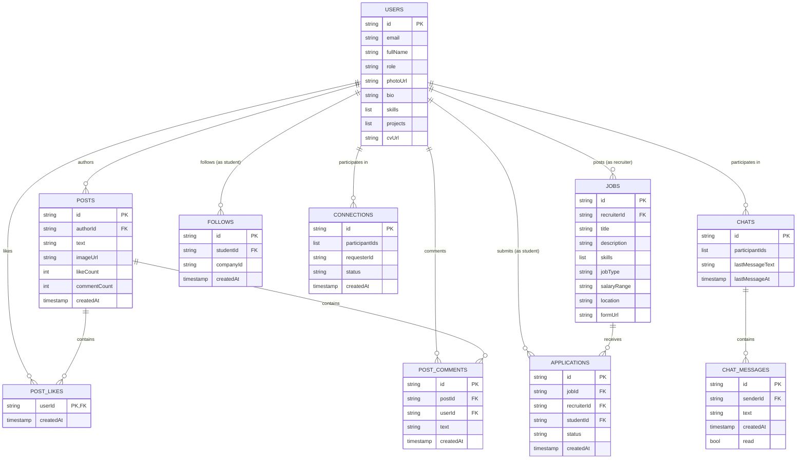

# UniLink — Complete Project Documentation

---

## 1. Executive Summary

**UniLink** is a cross-platform mobile networking and recruitment application developed as a university graduation project. Its primary mission is to bridge the gap between academia and industry by connecting university students with recruiters and potential employers in a unified digital ecosystem.

The project is architected as a Flutter client-side mobile application (supporting Android, iOS, and Web targets) underpinned by a Serverless / Backend-as-a-Service (BaaS) architecture using **Google Firebase** (Firebase Authentication, Cloud Firestore, Firebase Storage) and **Cloudinary** for cloud media storage. In addition, an auxiliary Node.js serverless microservice is deployed on **Vercel** (`https://unilink-two.vercel.app/api/sendemails`) leveraging **SendGrid** to deliver transactional welcome emails upon user registration.

### Core System Scope & Purpose
* **Students** can build professional profiles, showcase skills and portfolio projects, link external profiles (GitHub, LinkedIn/UniLink, Personal Website), upload/link CVs, discover other students and recruiters, send peer connection requests, chat in real-time with mutual connections, browse job postings from connected recruiters, and submit job applications.
* **Recruiters** can create job listings (specifying title, description, required skills, job type, salary range, location, and optional external application URL), review submitted applicant profiles, accept or reject candidates, and engage in direct real-time messaging with connected applicants.
* **Social Feed** allows users to broadcast updates, project highlights, and text/image posts, with interactive likes and threaded comments.

### State of the Repository
The project structure strictly embraces **Feature-First Clean Architecture** with the **BLoC (Business Logic Component)** pattern for state management. While the core user journey (Authentication, Feed, Job Listings, Connections, Real-time Chat, and Profile Editing) is functional, several architectural discrepancies exist between the client implementation and the Firebase Security Rules (`firestore.rules`), alongside legacy mockup files, orphaned drafts, hardcoded external configuration presets, and missing backend validation. This document provides an exhaustive, evidence-based reference manual and technical knowledge base for engineering handoff.

---

## 2. Project Identity & Purpose

### 2.1 Problem Statement
University students face high barriers entering the workforce: generic job boards are disconnected from university communities, portfolios are scattered across fragmented platforms, and direct access to company recruiters is scarce. Conversely, recruiters struggle to filter early-career talent based on verified academic background and demonstrable projects.

### 2.2 Solution Overview
UniLink provides a specialized professional network tailored for academia and early careers:
1. **Role-Differentiated Ecosystem**: Clear separation between `student` and `recruiter` roles with custom profile schemas and permissions.
2. **Portfolio & CV Aggregation**: Direct attachment of project repositories, portfolio websites, skills tags, and CV documents.
3. **Restricted Communication Gateway**: Chat is strictly restricted to mutual connections, preventing spam and maintaining professional communication standards.
4. **Targeted Opportunity Discovery**: Job board filtered specifically for early-career opportunities and recruiter networks.

---

## 3. Current Technology Stack

| Layer / Concern | Technology / Library | Version (Pubspec / Lock) | Description / Usage |
| :--- | :--- | :--- | :--- |
| **Mobile Framework** | Flutter SDK | Dart SDK `^3.11.0`, Flutter 3.x | Cross-platform UI toolkit targeting Android, iOS, Web |
| **State Management** | `flutter_bloc` / `bloc` | `^9.0.0` | Reactive state management, separation of UI and business logic |
| **Value Equality** | `equatable` | `^2.0.5` | Value-based equality comparisons for States, Events, and Entities |
| **Functional Error Handling** | `dartz` | `^0.10.1` | Functional `Either<Failure, Success>` return types in domain layer |
| **Dependency Injection** | `get_it` | `^7.6.7` | Service locator for singletons, datasources, repositories, and blocs |
| **Authentication** | `firebase_auth` | `^5.3.1` | Email/password authentication, session management |
| **Primary Database** | `cloud_firestore` | `^5.5.1` | NoSQL real-time cloud document database |
| **Object Storage (Cloud)** | `firebase_storage` | `^12.3.1` | SDK present; used for CV storage helpers |
| **Media Hosting** | Cloudinary REST API | Custom HTTP Integration | Unsigned image/file upload via multipart POST requests |
| **Push Notifications** | `firebase_messaging` | `^15.1.5` | Installed in dependencies (SDK integrated, usage pending) |
| **Local Notifications** | `flutter_local_notifications` | `^21.0.0` | Installed in dependencies (usage pending) |
| **Local Persistence** | `shared_preferences` | `^2.3.2` | Persistent key-value store for onboarding completion flags |
| **HTTP Client** | `http` | `^1.1.0` | Transactional email trigger and Cloudinary multipart uploads |
| **External URL Launch** | `url_launcher` | `^6.2.5` | Opening GitHub, LinkedIn, portfolio links, and external job forms |
| **Image / File Picking** | `image_picker`, `file_picker` | `^1.1.2`, `^10.3.2` | Media selection from gallery and local storage |
| **Image Caching & View** | `cached_network_image`, `photo_view` | `^3.4.1`, `^0.15.0` | Progressive network image loading and zoomable viewing |
| **UI Indicators** | `smooth_page_indicator` | `^1.2.0+3` | Page indicator dots on the onboarding tutorial screens |
| **Reactive Extensions** | `rxdart` | `^0.28.0` | Stream combination (`combineLatest2`) for jobs & connection feeds |
| **Permissions** | `permission_handler` | `^11.0.0` | Granular runtime permissions |
| **Serverless Backend** | Node.js (Vercel Serverless) | Express `^5.2.1`, Node.js | Microservice deployed on Vercel handling SendGrid email dispatch |
| **Email Service** | `@sendgrid/mail` | `^8.1.6` | Transactional welcome email delivery API |

---

## 4. Complete Repository Structure

```text
UniLink/
├── .env                                  # Root environment file (present, currently empty)
├── .firebaserc                           # Firebase CLI project binding ("unilink-adbaa")
├── .flutter-plugins-dependencies        # Generated Flutter plugin mapping
├── .gitignore                            # Git exclusion rules
├── AGENTS.md                             # Vercel deployment best practices guide
├── Plan/
│   ├── plan.txt                          # Early development roadmap / sprint checklist
│   └── rules                             # Emergency Git reset commands notes
├── README.md                             # Developer and public overview documentation
├── analysis_options.yaml                 # Linter configuration (flutter_lints, deprecated overrides)
├── android/                              # Android native platform project
│   ├── app/
│   │   ├── build.gradle.kts              # Application build config (Kotlin DSL, desugaring enabled)
│   │   ├── google-services.json          # Firebase Android configuration file
│   │   └── src/main/AndroidManifest.xml  # Manifest with INTERNET, storage, and intent queries
├── api/                                  # Serverless Backend microservice
│   ├── .gitignore                        # Node modules exclusion
│   ├── package.json                      # Dependencies: @sendgrid/mail, express, dotenv
│   ├── package-lock.json                 # Dependency lockfile
│   └── sendemails.js                     # Vercel serverless function for SendGrid welcome email
├── assets/
│   └── images/
│       ├── logo.png                      # Primary circular application logo
│       └── unilink_logo.png              # Launcher branding icon
├── firebase.json                         # FlutterFire CLI configuration and function mappings
├── firestore.rules                       # Cloud Firestore security rules
├── images/                               # Screenshots and documentation visual assets
│   ├── Feed.jpeg
│   ├── Profile.jpeg
│   ├── login.jpeg
│   ├── onborad1.jpeg
│   ├── onborad2.jpeg
│   ├── onborad3.jpeg
│   └── profileStudent.jpeg
├── ios/                                  # iOS native project structure
│   └── Runner/GoogleService-Info.plist   # Firebase iOS configuration file
├── lib/                                  # Flutter application source code
│   ├── firebase_options.dart             # Generated Firebase platform configuration
│   ├── main.dart                         # Application entry point, global Blocs, theme & routing
│   ├── core/                             # Cross-cutting foundational modules
│   │   ├── config/
│   │   │   └── injection_container.dart  # GetIt dependency injection setup
│   │   ├── constants/
│   │   │   └── onboarding_prefs.dart     # SharedPreferences keys
│   │   ├── errors/
│   │   │   └── failures.dart             # Failure class hierarchy for functional error handling
│   │   ├── routing/
│   │   │   └── app_router.dart           # AppRouter class holding GlobalKey<NavigatorState>
│   │   ├── services/
│   │   │   ├── cloudinary_service.dart   # Unsigned Cloudinary upload service (images & files)
│   │   │   └── firebase_storage_service.dart # Firebase Storage CV upload helper
│   │   ├── theme/
│   │   │   └── app_theme.dart            # Material 3 light and dark theme definitions
│   │   ├── usecases/
│   │   │   └── usecase.dart              # Base UseCase<Type, Params> abstract contract
│   │   └── utils/
│   │       └── input_validators.dart     # Static regex validators (email, password, name)
│   └── features/                         # Feature-First modular components
│       ├── auth/                         # Authentication & User Management
│       │   ├── data/
│       │   │   ├── datasources/
│       │   │   │   └── auth_remote_datasource.dart # FirebaseAuth & Firestore user doc operations
│       │   │   ├── models/
│       │   │   │   └── app_user_model.dart         # Firestore serialization & AppUser extension
│       │   │   └── repositories/
│       │   │       └── auth_repository_impl.dart   # AuthRepository error-mapping implementation
│       │   ├── domain/
│       │   │   ├── entities/
│       │   │   │   ├── app_user.dart               # Core user entity (id, email, role, skills, etc.)
│       │   │   │   ├── user_document.dart          # Entity for attached document metadata
│       │   │   │   ├── user_education.dart         # Entity for education history
│       │   │   │   └── user_project.dart           # Entity for project showcase
│       │   │   ├── repositories/
│       │   │   │   └── auth_repository.dart        # Abstract repository contract
│       │   │   └── usecases/
│       │   │       ├── get_current_user.dart       # Retrieves active session user
│       │   │       ├── login.dart                  # Authenticates with email & password
│       │   │       ├── logout.dart                 # Signs out of Firebase session
│       │   │       ├── register.dart               # Creates auth user and Firestore record
│       │   │       └── reset_password.dart         # Triggers password reset email
│       │   └── presentation/
│       │       ├── bloc/
│       │       │   ├── auth_bloc.dart              # Auth state machine & event handlers
│       │       │   ├── auth_event.dart             # AuthCheckRequested, AuthLoginRequested, etc.
│       │       │   └── auth_state.dart             # AuthStatus enum and user session state
│       │       ├── login_screen.dart               # [LEGACY/UNUSED] Mockup login screen
│       │       ├── register_screen.dart            # [LEGACY/UNUSED] Mockup register screen
│       │       ├── reset_password_screen.dart      # [LEGACY/UNUSED] Mockup reset password screen
│       │       ├── splash_screen.dart              # Bootstrap check (onboarding + auth check)
│       │       └── pages/
│       │           ├── login_page.dart             # Production BLoC-driven login view
│       │           ├── onboarding_page.dart        # 3-slide introduction with PageIndicator
│       │           ├── register_page.dart          # Production registration & role selector
│       │           └── reset_password_page.dart    # Password recovery submission view
│       ├── chat/                         # Direct Messaging Feature
│       │   ├── data/
│       │   │   └── chat_remote_datasource.dart     # Firestore chats & messages subcollection queries
│       │   └── presentation/
│       │       └── pages/
│       │           ├── chat_detail_page.dart       # Real-time message thread view & message sender
│       │           ├── chat_list_page.dart         # Conversation list & pending request viewer
│       │           └── Untitled                    # [DEAD CODE] Abandoned duplicate of chat_list_page
│       ├── connections/                  # Peer Connection Feature
│       │   └── data/
│       │       └── connections_remote_datasource.dart # Firestore connections collection operations
│       ├── follows/                      # Company Following Feature
│       │   ├── data/
│       │   │   ├── follows_remote_datasource.dart  # Firestore follows collection operations
│       │   │   └── repositories/
│       │   │       └── follows_repository_impl.dart # Concrete FollowsRepository implementation
│       │   └── domain/
│       │       ├── repositories/
│       │       │   └── follows_repository.dart     # Abstract repository contract
│       │       └── usecases/
│       │           ├── follow_company.dart         # UseCase to follow a company
│       │           ├── unfollow_company.dart       # UseCase to unfollow a company
│       │           └── watch_followed_company_ids.dart # Stream followed company ID list
│       ├── home/                         # Main Navigation Shell
│       │   └── presentation/
│       │       └── home_shell.dart                 # BottomNavigationBar & IndexedStack tabs
│       ├── jobs/                         # Opportunities & Applications
│       │   ├── data/
│       │   │   ├── datasources/
│       │   │   │   └── jobs_remote_datasource.dart # Firestore jobs & applications CRUD
│       │   │   ├── models/
│       │   │   │   ├── job_application_model.dart  # Application entity serializer
│       │   │   │   └── job_model.dart              # Job listing serializer
│       │   │   └── repositories/
│       │   │       └── jobs_repository_impl.dart   # JobsRepository with Rx combined streams
│       │   ├── domain/
│       │   │   ├── entities/
│       │   │   │   ├── job.dart                    # Core job domain entity
│       │   │   │   └── job_application.dart        # Application domain entity
│       │   │   ├── repositories/
│       │   │   │   └── jobs_repository.dart        # Abstract repository contract
│       │   │   └── usecases/
│       │   │       ├── apply_to_job.dart           # UseCase to apply for a job
│       │   │       ├── create_job.dart             # UseCase to post a job listing
│       │   │       ├── delete_job.dart             # UseCase to delete a job listing
│       │   │       ├── stream_followed_jobs.dart   # Stream jobs from connected recruiters
│       │   │       ├── stream_job_applications.dart# Stream applicants for a specific job
│       │   │       └── stream_recruiter_jobs.dart  # Stream recruiter's own posted jobs
│       │   └── presentation/
│       │       ├── bloc/
│       │       │   ├── jobs_bloc.dart              # Jobs event handler and emit.onEach streams
│       │       │   ├── jobs_event.dart             # JobsStartFeed, JobsCreateRequested, etc.
│       │       │   └── jobs_state.dart             # JobsState (loading, submitting, job list)
│       │       └── pages/
│       │           ├── create_job_page.dart        # Recruiter job creation form
│       │           ├── job_applicants_page.dart    # Applicant management (accept/reject)
│       │           └── jobs_page.dart              # Primary job list view & apply bottom sheet
│       ├── posts/                        # Social Feed, Likes & Comments
│       │   ├── data/
│       │   │   ├── datasources/
│       │   │   │   └── posts_remote_datasource.dart# Firestore posts, likes & comments queries
│       │   │   ├── models/
│       │   │   │   ├── comment_model.dart          # Comment serializer
│       │   │   │   └── post_model.dart             # Post serializer
│       │   │   └── repositories/
│       │   │       └── post_repository_impl.dart   # Post repository with pagination cursor cache
│       │   ├── domain/
│       │   │   ├── entities/
│       │   │   │   ├── comment.dart                # Comment domain entity
│       │   │   │   └── post.dart                   # Post domain entity
│       │   │   ├── repositories/
│       │   │   │   └── post_repository.dart        # Abstract repository contract
│       │   │   └── usecases/
│       │   │       ├── add_comment.dart            # UseCase to post a comment
│       │   │       ├── create_post.dart            # UseCase to publish a post (with image)
│       │   │       ├── delete_post.dart            # UseCase to delete own post
│       │   │       ├── get_feed_page.dart          # UseCase for paginated feed query
│       │   │       ├── like_post.dart              # UseCase to like a post
│       │   │       └── unlike_post.dart            # UseCase to unlike a post
│       │   └── presentation/
│       │       ├── bloc/
│       │       │   ├── feed_bloc.dart              # Infinite scroll pagination & like state
│       │       │   ├── feed_event.dart             # FeedLoadInitial, FeedLoadMore, etc.
│       │       │   └── feed_state.dart             # FeedState with posts list and cursors
│       │       └── pages/
│       │           └── feed_page.dart              # Infinite scroll feed, composer & comments sheet
│       ├── profile/                      # User Profile & Portfolio
│       │   ├── data/
│       │   │   └── profile_remote_datasource.dart  # User profile streaming & updates
│       │   └── presentation/
│       │       └── pages/
│       │           └── profile_page.dart           # Massive composite profile & edit bottom sheet
│       ├── request/                      # External Network Utilities
│       │   └── request.dart              # sendWelcomeEmail HTTP client to Vercel API
│       └── search/                       # Directory & Discovery
│           └── presentation/
│               └── pages/
│                   └── search_page.dart            # Real-time user directory & skill tag filters
├── package.json                          # Root Node dependencies (mirroring api/package.json)
├── pubspec.yaml                          # Flutter package manifest & assets
└── unilink.iml                           # IntelliJ module configuration
```

---

## 5. Architecture

UniLink is structured following **Feature-First Clean Architecture**, which separates code into distinct feature slices (`auth`, `posts`, `jobs`, `chat`, `profile`, `connections`, `follows`, `search`), while maintaining strict layer isolation within each feature.

```
┌─────────────────────────────────────────────────────────────┐
│                     Presentation Layer                      │
│       Pages, Widgets, Modal Sheets, Form Controllers        │
│                BLoC State Machine (Bloc / Cubit)            │
└──────────────────────────────┬──────────────────────────────┘
                               │ Dispatches Events / Reads State
                               ▼
┌─────────────────────────────────────────────────────────────┐
│                        Domain Layer                         │
│            Use Cases (Business Logic Transactions)          │
│            Entities (Pure Dart Business Models)             │
│            Repository Interfaces (Abstract Contracts)       │
└──────────────────────────────┬──────────────────────────────┘
                               │ Implements Contracts
                               ▼
┌─────────────────────────────────────────────────────────────┐
│                         Data Layer                          │
│          Repository Implementations (Error Mapping)         │
│          Data Models (fromFirestore, toFirestore)           │
│          Remote Data Sources (Firestore, Auth, HTTP)        │
└──────────────────────────────┬──────────────────────────────┘
                               │ Network / SDK Calls
                               ▼
┌─────────────────────────────────────────────────────────────┐
│                    External Infrastructure                  │
│       Cloud Firestore  ·  Firebase Auth  ·  Cloudinary      │
│       Vercel Serverless Function  ·  SendGrid API           │
└─────────────────────────────────────────────────────────────┘
```

### Architectural Layer Responsibilities
1. **Presentation Layer (`features/<feature>/presentation`)**:
   * Contains Flutter UI components (`pages/`, `widgets/`) and BLoC components (`bloc/`).
   * UI components dispatch events to Blocs and rebuild via `BlocBuilder`, `BlocConsumer`, or `StreamBuilder`.
   * Never communicates directly with databases or network APIs (with documented exceptions in `ProfilePage` and `SearchPage`).
2. **Domain Layer (`features/<feature>/domain`)**:
   * Completely decoupled from third-party SDKs (`flutter`, `firebase`).
   * Entities (`entities/`) extend `Equatable` to represent pure business models.
   * Usecases (`usecases/`) inherit from `UseCase<Type, Params>` and return `Future<Either<Failure, Type>>`.
   * Defines repository interfaces (`repositories/`) that establish the contract for data operations.
3. **Data Layer (`features/<feature>/data`)**:
   * Implements the domain repository contracts (`repositories/`).
   * Models (`models/`) extend domain entities and provide serialization logic (`fromFirestore`, `toFirestore`).
   * Data sources (`datasources/`) interact directly with external SDKs (`FirebaseAuth`, `FirebaseFirestore`, `CloudinaryService`).
   * Maps third-party exceptions (`FirebaseAuthException`, `FirebaseException`) into strongly typed `Failure` objects (`ServerFailure`, `AuthFailure`).

---

## 6. Application Data Flow

### 6.1 User Registration Data Flow
```
User (UI: RegisterPage)
   │ Submits Form (Name, Email, Password, Role)
   ▼
AuthBloc
   │ Dispatches AuthRegisterRequested
   ▼
Register UseCase
   │ Invokes AuthRepository.register(...)
   ▼
AuthRepositoryImpl
   │ Calls AuthRemoteDataSource.register(...)
   ▼
AuthRemoteDataSourceImpl
   ├── 1. FirebaseAuth.createUserWithEmailAndPassword(...)
   ├── 2. Firestore.collection('users').doc(uid).set(...)
   └── 3. sendWelcomeEmail(email, name) -> HTTP POST -> Vercel API -> SendGrid
   ▼
Returns AppUserModel -> Returns Right(AppUser) -> Emits AuthStatus.authenticated
   ▼
App State Change -> MaterialApp Navigator routes user to HomeShell
```

### 6.2 Infinite Scroll Feed Data Flow
```
FeedPage (ListView with ScrollController)
   │ Scroll threshold reached (<200px remaining)
   ▼
FeedBloc
   │ Dispatches FeedLoadMore
   ▼
GetFeedPage UseCase
   │ Calls PostRepository.getFeedPage(lastPost, limit: 10)
   ▼
PostRepositoryImpl
   │ Resolves cached DocumentSnapshot for lastPost.id
   ▼
PostsRemoteDataSourceImpl
   ├── 1. ConnectionsRemoteDataSource.watchConnectedUserIds(currentUser.uid)
   ├── 2. Firestore query: collection('posts').orderBy('createdAt', desc: true).limit(30)
   ├── 3. In-memory filter: retain posts authored by me or connected users
   └── 4. Concurrent check: collection('posts').doc(id).collection('likes').doc(myUid).get()
   ▼
PaginatedPostsResult -> Right(List<Post>) -> Emits FeedState with appended posts
   ▼
FeedPage ListView renders new PostCards
```

---

## 7. Frontend Architecture

### 7.1 Entry Point & Initialization (`lib/main.dart`)
* Execution begins in `main()`:
  1. `WidgetsFlutterBinding.ensureInitialized()` stabilizes the framework bindings.
  2. `Firebase.initializeApp(options: DefaultFirebaseOptions.currentPlatform)` initializes the platform-specific Firebase configuration.
  3. `initDependencies()` configures the `GetIt` service locator container.
  4. Debug prints current user UID.
  5. Mounts the root widget `UniLinkApp`.
* `UniLinkApp` wraps the tree in a `MultiBlocProvider` providing:
  * `AuthBloc`: Injected via `sl<AuthBloc>()`.
  * `FeedBloc`: Injected via `sl<FeedBloc>()..add(FeedLoadInitial())`.
  * `JobsBloc`: Injected via `sl<JobsBloc>()`.
* A global `BlocListener<AuthBloc, AuthState>` monitors authentication status transitions:
  * `AuthStatus.authenticated` ➔ Navigates to `HomeShell.routeName` (`/home`), clearing the backstack.
  * `AuthStatus.unauthenticated` ➔ Navigates to `LoginPage.routeName` (`/login`), clearing the backstack.

### 7.2 Dependency Injection Container (`lib/core/config/injection_container.dart`)
Dependencies are registered using `get_it`:
* **Core External Singletons**: `fb.FirebaseAuth.instance`, `FirebaseFirestore.instance`, `FirebaseStorage.instance`, `CloudinaryService()`.
* **Remote DataSources** (Lazy Singletons): `ConnectionsRemoteDataSourceImpl`, `AuthRemoteDataSourceImpl`, `PostsRemoteDataSourceImpl`, `ProfileRemoteDataSourceImpl`, `ChatRemoteDataSourceImpl`, `FollowsRemoteDataSourceImpl`, `JobsRemoteDataSourceImpl`.
* **Repositories** (Lazy Singletons): `AuthRepositoryImpl`, `PostRepositoryImpl`, `FollowsRepositoryImpl`, `JobsRepositoryImpl`.
* **Use Cases** (Lazy Singletons): 18 distinct usecases spanning Auth, Posts, Follows, and Jobs.
* **BLoCs** (Factories): New instances created on request: `AuthBloc`, `FeedBloc`, `JobsBloc`.

---

## 8. Frontend Pages / Screens

| Screen / Page | Path | Route Name | Access Control | Purpose & Key Features |
| :--- | :--- | :--- | :--- | :--- |
| **SplashScreen** | `lib/features/auth/presentation/splash_screen.dart` | `/` | Public | Checks `kOnboardingCompletedKey` in SharedPreferences. Redirects to `/onboarding` if uncompleted; otherwise dispatches `AuthCheckRequested()`. |
| **OnboardingPage** | `lib/features/auth/presentation/pages/onboarding_page.dart` | `/onboarding` | Public | 3-page interactive swipe walkthrough introducing UniLink, networking, and direct messaging with a `SmoothPageIndicator`. Marks onboarding as complete in SharedPreferences. |
| **LoginPage** | `lib/features/auth/presentation/pages/login_page.dart` | `/login` | Public (Unauth) | Form validation for email/password. Dispatches `AuthLoginRequested`. Links to Register and Reset Password. |
| **RegisterPage** | `lib/features/auth/presentation/pages/register_page.dart` | `/register` | Public (Unauth) | Full name, email, password validation. Interactive radio selector for `UserRole.student` vs `UserRole.recruiter`. Dispatches `AuthRegisterRequested`. |
| **ResetPasswordPage** | `lib/features/auth/presentation/pages/reset_password_page.dart` | `/reset-password` | Public | Submits password recovery request via `AuthResetPasswordRequested`. |
| **HomeShell** | `lib/features/home/presentation/home_shell.dart` | `/home` | Authenticated | Container for main navigation using `NavigationBar` and `IndexedStack` keeping 5 persistent tabs alive: Feed, Jobs, Search, Chat, Profile. Includes theme toggle button. |
| **FeedPage** | `lib/features/posts/presentation/pages/feed_page.dart` | Embedded Tab 0 | Authenticated | Infinite scroll feed of connection posts. Post composer with camera/gallery picker (`ImagePicker`). Expandable threaded comment bottom sheet with real-time add comment. |
| **JobsPage** | `lib/features/jobs/presentation/pages/jobs_page.dart` | Embedded Tab 1 | Authenticated | Dynamic job board based on role: students see jobs from connected recruiters; recruiters see their own postings. Supports application submission bottom sheet. |
| **CreateJobPage** | `lib/features/jobs/presentation/pages/create_job_page.dart` | Pushed Route | Recruiter Only | Multi-field job posting form (title, description, comma-separated skills, job type, salary, location, optional Google Form/external URL). |
| **JobApplicantsPage** | `lib/features/jobs/presentation/pages/job_applicants_page.dart` | Pushed Route | Recruiter Only | Streams submitted applications for a job. Enables accepting or rejecting candidates and tapping an applicant to view their full profile. |
| **SearchPage** | `lib/features/search/presentation/pages/search_page.dart` | Embedded Tab 2 | Authenticated | Live query search by user name and email. Interactive skill tag chips for multi-criteria filtering. Displays connection status button. |
| **ChatListPage** | `lib/features/chat/presentation/pages/chat_list_page.dart` | Embedded Tab 3 | Authenticated | Lists pending incoming connection requests with Accept buttons. Displays active connections with last message previews. |
| **ChatDetailPage** | `lib/features/chat/presentation/pages/chat_detail_page.dart` | `/chat-detail` | Mutual Connections | Real-time direct messaging stream with auto-scrolling ListView. Guarded by connection validation check (`areConnected`). |
| **ProfilePage** | `lib/features/profile/presentation/pages/profile_page.dart` | Embedded Tab 4 / Pushed Route | Authenticated | Dual mode: "My Profile" (edit bio, skills, projects, change avatar via Cloudinary, add CV link, log out) or "User Profile" (view credentials, connect, follow company, or open chat). |

---

## 9. Frontend Components & Widgets

### 9.1 Shared Design System (`lib/core/theme/app_theme.dart`)
* **Palette**:
  * Primary: `#3E7BFA` (Professional Blue)
  * Secondary / Accent: `#00C4B4` (Teal)
  * Light Background: `#F5F7FB`
  * Dark Background: `#0F172A` (Slate Dark)
  * Surface Dark: `#1E293B`
* **Typography**: Material 3 typography with custom font weight scaling for headers and cards.
* **Component Theming**: Rounded borders (`BorderRadius.circular(12)` to `16`), elevation suppression, outlined border input themes.

### 9.2 Custom Component Breakdown
* **`_FeedComposerCard`** (`feed_page.dart`): Quick post trigger card showing user avatar, "Start a post" placeholder, and photo/article shortcut buttons.
* **`_PostCard`** (`feed_page.dart`): Card rendering post header, author avatar, timestamp format, body text, optional Cloudinary aspect ratio image, skill tag chips, like counter with toggle, and comment trigger.
* **`_CreatePostSheet`** (`feed_page.dart`): Draggable modal sheet for composing post text, selecting/clearing images, and uploading.
* **`_PostCommentsSheet`** (`feed_page.dart`): Bottom sheet with `FutureBuilder` loading comments and a bottom input bar.
* **`_JobCard`** (`jobs_page.dart`): Renders job metadata badges (location, type, salary), skills tags, and role-based action buttons ("Apply", "View Applicants", "Delete").
* **`_ApplicantCard`** (`job_applicants_page.dart`): Candidate card with status badge, clickable avatar to student profile, and Accept/Reject buttons.
* **`_ConnectedUserTile`** (`chat_list_page.dart`): Conversation tile displaying avatar, connection name, and real-time last message snippet.
* **`_sectionCard`** (`profile_page.dart`): Reusable bordered card wrapper for About, Featured, Connect, CV, Projects, and Skills sections.

---

## 10. State Management

The application utilizes **BLoC (Business Logic Component)** alongside scoped reactive streams (`StreamBuilder` and `FutureBuilder`).

```
                ┌──────────────────────────────┐
                │        User Action / UI      │
                └──────────────┬───────────────┘
                               │ add(Event)
                               ▼
                ┌──────────────────────────────┐
                │          Bloc Engine         │
                │   (on<Event>(_handler))      │
                └──────────────┬───────────────┘
                               │ Invokes UseCase
                               ▼
                ┌──────────────────────────────┐
                │    Domain / Data Layer       │
                └──────────────┬───────────────┘
                               │ Returns Either<Failure, Data>
                               ▼
                ┌──────────────────────────────┐
                │    emit(state.copyWith(...)) │
                └──────────────┬───────────────┘
                               │ Emits State
                               ▼
                ┌──────────────────────────────┐
                │     BlocConsumer / UI        │
                └──────────────────────────────┘
```

### 10.1 Active BLoCs
1. **`AuthBloc`** (`features/auth/presentation/bloc/`):
   * **Events**: `AuthCheckRequested`, `AuthLoginRequested`, `AuthRegisterRequested`, `AuthResetPasswordRequested`, `AuthLogoutRequested`.
   * **States**: `AuthStatus.initial`, `loading`, `authenticated`, `unauthenticated`, `passwordResetEmailSent`, `failure`.
2. **`FeedBloc`** (`features/posts/presentation/bloc/`):
   * **Events**: `FeedLoadInitial`, `FeedLoadMore`, `FeedRefresh`, `FeedCreatePost`, `FeedToggleLike`, `FeedAddComment`, `FeedDeletePost`.
   * **States**: `FeedState` containing `posts`, `isLoadingInitial`, `isLoadingMore`, `isCreatingPost`, `hasMore`, `errorMessage`.
3. **`JobsBloc`** (`features/jobs/presentation/bloc/`):
   * **Events**: `JobsStartFeed`, `JobsStartRecruiterJobs`, `JobsCreateRequested`, `JobsDeleteRequested`, `JobsApplyRequested`, `JobsClearMessage`.
   * **States**: `JobsState` containing `jobs`, `isLoading`, `isSubmitting`, `isApplying`, `errorMessage`, `infoMessage`. Uses `emit.onEach` to bridge Firestore reactive streams directly into BLoC states.

### 10.2 Architectural State Duplication / Shadowing Caveat
In `lib/main.dart`, `MultiBlocProvider` instantiates `FeedBloc` and `JobsBloc` globally at the root. However, in `lib/features/home/presentation/home_shell.dart`, local `BlocProvider<FeedBloc>` and `BlocProvider<JobsBloc>` instances are created again inside the tab pages array. This creates localized child bloc instances that shadow the global ones, causing root state changes not to propagate to the inner tab views.

---

## 11. Routing & Navigation

Navigation is handled via declarative static routes in `MaterialApp` coupled with a global navigator key:

* **Global Navigator Key**: `AppRouter.navigatorKey` (`lib/core/routing/app_router.dart`) allows navigation without direct `BuildContext` access.
* **Registered Named Routes**:
  * `'/'` ➔ `SplashScreen`
  * `'/onboarding'` ➔ `OnboardingPage`
  * `'/login'` ➔ `LoginPage`
  * `'/register'` ➔ `RegisterPage`
  * `'/reset-password'` ➔ `ResetPasswordPage`
  * `'/home'` ➔ `HomeShell`
  * `'/chat-detail'` ➔ `ChatDetailPage`
* **Dynamic MaterialPageRoute Transitions**:
  * Pushing `CreateJobPage` from `JobsPage`.
  * Pushing `JobApplicantsPage(jobId: ...)` from `JobsPage`.
  * Pushing `ProfilePage(userId: ...)` from `SearchPage` or `JobApplicantsPage`.

---

## 12. Backend Architecture

UniLink operates on a hybrid Serverless BaaS architecture:

```
┌────────────────────────────────────────────────────────────────────────┐
│                          Flutter Client (UniLink)                      │
└───────┬───────────────────────────┬───────────────────────────┬────────┘
        │ Direct SDK Calls          │ Multipart POST            │ JSON POST
        ▼                           ▼                           ▼
┌──────────────────┐       ┌──────────────────┐       ┌──────────────────┐
│  Google Firebase │       │ Cloudinary API   │       │ Vercel Serverless│
│  - Auth (Tokens) │       │ - Image Hosting  │       │ - sendemails.js  │
│  - Cloud Fire-   │       │ - Raw File Store │       └─────────┬────────┘
│    store (NoSQL) │       └──────────────────┘                 │ SendGrid API
│  - Storage       │                                            ▼
└──────────────────┘                                  ┌──────────────────┐
                                                      │ SendGrid Mail    │
                                                      └──────────────────┘
```

### 12.1 Backend Responsibilities
1. **Firebase Authentication**: Manages user identity, password hashing (PBKDF2/scrypt internal to Firebase), JWT token generation, token refresh, and session revocation.
2. **Cloud Firestore**: Real-time document database managing collections, transactional updates (likes and comments counts), security enforcement (`firestore.rules`), and indexing.
3. **Cloudinary**: Handles user avatar uploads and post images via unsigned upload presets.
4. **Vercel Serverless Function (`api/sendemails.js`)**: An isolated Node.js serverless endpoint running on Vercel Fluid Compute that exposes a POST handler invoking `@sendgrid/mail`.

---

## 13. API Routes & Endpoint Inventory

### 13.1 Vercel Microservice API

| HTTP Method | Endpoint | Auth | Headers | Request Body | Response (Success) | Response (Error) | Purpose |
| :--- | :--- | :--- | :--- | :--- | :--- | :--- | :--- |
| `POST` | `https://unilink-two.vercel.app/api/sendemails` | None (Public) | `Content-Type: application/json` | `{"email": "string", "name": "string"}` | `200 OK: {"message": "Email sent successfully"}` | `400 Bad Request: {"message": "Email is required"}`<br>`405 Method Not Allowed`<br>`500 Internal Error` | Dispatches welcome email via SendGrid API |

### 13.2 Cloudinary Media API

| HTTP Method | Endpoint | Auth | Request Format | Response Payload | Purpose |
| :--- | :--- | :--- | :--- | :--- | :--- |
| `POST` | `https://api.cloudinary.com/v1_1/dthenjea4/image/upload` | Unsigned Preset | `multipart/form-data` (`upload_preset: testttt`, `file: <binary>`) | JSON containing `secure_url` | Uploads profile photos and post attachment images |
| `POST` | `https://api.cloudinary.com/v1_1/dthenjea4/raw/upload` | Unsigned Preset | `multipart/form-data` (`upload_preset: testttt`, `file: <binary>`) | JSON containing `secure_url` | Uploads raw documents (CVs / PDFs) |

---

## 14. Authentication & Authorization

### 14.1 Authentication Lifecycle
1. **Sign Up**:
   * User inputs full name, email, password, and selects role (`student` vs `recruiter`).
   * `FirebaseAuth.createUserWithEmailAndPassword` generates a Firebase Auth record with unique `uid`.
   * A document is created in Firestore at `users/{uid}` storing the profile fields and role.
   * `sendWelcomeEmail` triggers an HTTP call to the Vercel microservice.
2. **Login**:
   * `FirebaseAuth.signInWithEmailAndPassword` validates credentials.
   * Fetches `users/{uid}` to deserialize the `AppUserModel` and role.
   * If Firestore document is missing, creates a fallback minimal user record.
3. **Session Persistence**:
   * Firebase SDK persists tokens automatically in device keychain/keystore.
   * `SplashScreen` dispatches `AuthCheckRequested` to revalidate `currentUser`.
4. **Logout**:
   * `FirebaseAuth.signOut()` clears local auth tokens.
   * State emits `AuthStatus.unauthenticated`, triggering redirect to `/login`.

### 14.2 Authorization & Roles

There are two primary roles in the system, represented by the `UserRole` enum:
```dart
enum UserRole { student, recruiter }
```

| Feature / Resource | Student Permission | Recruiter Permission |
| :--- | :--- | :--- |
| **Browse Social Feed** | Full Read / Write | Full Read / Write |
| **Create Posts / Comments** | Allowed | Allowed |
| **Create Job Listings** | Denied | Allowed |
| **View Job Listings** | Allowed (From connected recruiters) | Allowed (Own posted jobs) |
| **Apply to Jobs** | Allowed | Denied |
| **View Job Applicants** | Denied | Allowed (For own jobs) |
| **Update Applicant Status** | Denied | Allowed (Accept / Reject) |
| **Search Directory** | Full Read | Full Read |
| **Send Connection Request** | Allowed | Allowed |
| **Direct Messaging** | Allowed (Mutual connections only) | Allowed (Mutual connections only) |
| **Follow Company** | Allowed (In domain logic) | Denied |

---

## 15. Database Architecture & Firestore Schemas

UniLink utilizes **Google Cloud Firestore**. Documents are organized into root-level collections and subcollections.

### 15.1 Collection: `users`
Path: `/users/{uid}`

| Field Name | Type | Required | Default | Description |
| :--- | :--- | :--- | :--- | :--- |
| `id` | String | Yes | Auto (UID) | Firebase Auth UID |
| `email` | String | Yes | `""` | User's email address |
| `fullName` | String | Yes | `""` | User's full name |
| `role` | String | Yes | `'student'` | `'student'` or `'recruiter'` |
| `photoUrl` | String? | No | `null` | Cloudinary CDN image URL |
| `bio` | String | No | `""` | Summary / introduction |
| `skills` | Array\<String\> | No | `[]` | List of professional skill tags |
| `projects` | Array\<Map\> | No | `[]` | Maps of `{"title": str, "description": str, "link": str?}` |
| `githubUrl` | String? | No | `null` | GitHub profile link |
| `linkedinUrl` | String? | No | `null` | UniLink / professional profile link |
| `websiteUrl` | String? | No | `null` | Personal website URL |
| `cvUrl` | String? | No | `null` | External or Cloudinary CV document URL |
| `searchNameLower` | String | Yes | `fullName.toLowerCase()` | Lowercase name for prefix search |
| `isOnline` | Boolean | No | `false` | Online presence indicator |
| `lastSeen` | Timestamp? | No | `null` | Last activity timestamp |
| `createdAt` | Timestamp | Yes | Server Timestamp | Profile creation date |
| `updatedAt` | Timestamp | Yes | Server Timestamp | Profile modification date |

### 15.2 Collection: `posts`
Path: `/posts/{postId}`

| Field Name | Type | Required | Default | Description |
| :--- | :--- | :--- | :--- | :--- |
| `id` | String | Yes | Doc ID | Unique post identifier |
| `authorId` | String | Yes | — | Author UID (matches `/users/{uid}`) |
| `authorName` | String | Yes | — | Snapshot of author's full name |
| `authorPhotoUrl` | String? | No | `null` | Snapshot of author's avatar URL |
| `text` | String | Yes | `""` | Body content of the post |
| `imageUrl` | String? | No | `null` | Cloudinary image URL |
| `skillsTags` | Array\<String\> | No | `[]` | Associated skill tags |
| `likeCount` | Integer | Yes | `0` | Total like counter |
| `commentCount` | Integer | Yes | `0` | Total comment counter |
| `createdAt` | Timestamp | Yes | Server Timestamp | Timestamp of post creation |
| `updatedAt` | Timestamp | Yes | Server Timestamp | Timestamp of post update |

#### Subcollection: `posts/{postId}/likes`
Path: `/posts/{postId}/likes/{userId}`

| Field Name | Type | Description |
| :--- | :--- | :--- |
| `userId` | String | UID of the liking user (document ID matches `userId`) |
| `createdAt` | Timestamp | Server timestamp when like occurred |

#### Subcollection: `posts/{postId}/comments`
Path: `/posts/{postId}/comments/{commentId}`

| Field Name | Type | Description |
| :--- | :--- | :--- |
| `id` | String | Unique comment identifier |
| `postId` | String | Parent post identifier |
| `userId` / `authorId` | String | UID of commenter |
| `userName` | String | Display name of commenter |
| `userPhotoUrl` | String? | Avatar URL of commenter |
| `text` | String | Comment message |
| `createdAt` | Timestamp | Timestamp when comment was added |

### 15.3 Collection: `connections`
Path: `/connections/{sorted_uidA_uidB}`
*(Note: Document ID is deterministically formed by sorting both user UIDs alphabetically and joining them with an underscore: `${min(uidA, uidB)}_${max(uidA, uidB)}`)*

| Field Name | Type | Description |
| :--- | :--- | :--- |
| `participantIds` | Array\<String\> | `[uidA, uidB]` |
| `participantNames` | Map\<String, String\> | `{ uidA: nameA, uidB: nameB }` |
| `participantPhotos`| Map\<String, String?\> | `{ uidA: photoA, uidB: photoB }` |
| `requesterId` | String | UID of the user who initiated the connection request |
| `status` | String | `'pending'` or `'accepted'` |
| `createdAt` | Timestamp | Server timestamp when request was sent |
| `updatedAt` | Timestamp | Server timestamp when accepted or modified |

### 15.4 Collection: `chats`
Path: `/chats/{sorted_uidA_uidB}`

| Field Name | Type | Description |
| :--- | :--- | :--- |
| `participantIds` | Array\<String\> | `[uidA, uidB]` |
| `participantNames` | Map\<String, String\> | `{ uidA: nameA, uidB: nameB }` |
| `lastMessageText` | String | Snippet of the latest message sent |
| `lastMessageAt` | Timestamp | Timestamp of latest message |
| `lastSenderId` | String | UID of user who sent latest message |

#### Subcollection: `chats/{threadId}/messages`
Path: `/chats/{threadId}/messages/{messageId}`

| Field Name | Type | Description |
| :--- | :--- | :--- |
| `text` | String | Message text content |
| `senderId` | String | UID of the sender |
| `createdAt` | Timestamp | Server timestamp when sent |
| `read` | Boolean | Read receipt flag (defaults to `false`) |

### 15.5 Collection: `jobs`
Path: `/jobs/{jobId}`

| Field Name | Type | Description |
| :--- | :--- | :--- |
| `recruiterId` | String | UID of the recruiter who posted the job |
| `recruiterName` | String | Display name of the recruiter |
| `recruiterAvatarUrl` | String? | Avatar of the recruiter |
| `title` | String | Job title (e.g. "Junior Flutter Developer") |
| `description` | String | Job description and requirements |
| `skills` | Array\<String\> | Required skills |
| `jobType` | String | E.g. "Full-time", "Remote", "Internship" |
| `salaryRange` | String | E.g. "$500 - $800 / month" |
| `location` | String | Office location or "Remote" |
| `formUrl` | String? | Optional external application URL (e.g. Google Form) |
| `createdAt` | Timestamp | Timestamp of job posting |
| `updatedAt` | Timestamp | Timestamp of update |

### 15.6 Collection: `applications`
Path: `/applications/{jobId_studentId}`
*(Note: Document ID is formed by `${jobId}_${studentId}` to guarantee exactly one application per student per job)*

| Field Name | Type | Description |
| :--- | :--- | :--- |
| `jobId` | String | ID of the job applied to |
| `recruiterId` | String | UID of the recruiter owning the job |
| `studentId` | String | UID of the applying student |
| `studentName` | String | Display name of the student |
| `status` | String | `'pending'`, `'accepted'`, or `'rejected'` |
| `createdAt` | Timestamp | Server timestamp when application was submitted |
| `updatedAt` | Timestamp? | Timestamp when status was updated by recruiter |

### 15.7 Collection: `follows`
Path: `/follows/{studentId_companyId}`

| Field Name | Type | Description |
| :--- | :--- | :--- |
| `studentId` | String | UID of the student |
| `companyId` | String | ID of the company being followed |
| `createdAt` | Timestamp | Timestamp when follow occurred |

---

## 16. Database Relationships Diagram



---

## 17. Business Logic & Feature Workflows

### 17.1 Connection Request & Acceptance
1. **User Action**: Student A searches for Student B on `SearchPage` or views their `ProfilePage`, and taps **"Connect"**.
2. **Frontend**: Calls `ConnectionsRemoteDataSource.sendRequest(myUid, myName, otherUid, otherName)`.
3. **Database**: Writes a document to `connections/{minUid_maxUid}` with `status: 'pending'` and `requesterId: StudentA.id`.
4. **Receiving End**: Student B opens `ChatListPage`. A stream on `watchIncomingRequests` displays Student A's request with an **"Accept"** button.
5. **Acceptance**: Student B taps **"Accept"**.
6. **Execution**: `acceptRequest(...)` updates the document status to `'accepted'`.
7. **Result**: Both users now see each other in their connection list, their posts appear in each other's Feed, and direct messaging becomes unlocked.

### 17.2 Direct Messaging Flow
1. **Validation**: Before entering or sending a message in `ChatDetailPage`, the app verifies `areConnected(myUid, otherUid)`. If not connected, chat is blocked.
2. **Message Dispatch**: User types message and taps Send.
3. **Transaction**: `ChatRemoteDataSource.sendMessage(...)` executes a Firestore transaction:
   * Adds new document to `chats/{threadId}/messages/`.
   * Updates root thread `chats/{threadId}` with `lastMessageText`, `lastMessageAt`, and `lastSenderId`.
4. **Streaming**: Both users subscribe to `watchMessages(threadId)` via Firestore snapshots; the UI appends the message and auto-scrolls to bottom.

### 17.3 Job Creation & Application Flow
1. **Recruiter Posting**:
   * Recruiter fills out `CreateJobPage`.
   * `JobsBloc` executes `CreateJob` usecase.
   * `JobsRemoteDataSource` adds record to `jobs` collection.
2. **Student Browsing**:
   * Student opens `JobsPage`.
   * `JobsBloc` subscribes to `streamFollowedJobs(studentId)`.
   * `JobsRepositoryImpl` uses RxDart `combineLatest2` to join `streamAllJobs()` with `watchConnectedUserIds(studentId)`.
   * Only jobs posted by recruiters who have an `'accepted'` connection with the student are shown.
3. **Application Submission**:
   * Student taps **"Apply"** on a job card.
   * Bottom sheet provides options: apply internally or open external form URL (`url_launcher`).
   * Tapping "Apply" writes a document to `/applications/${jobId}_${studentId}` with `status: 'pending'`.
4. **Recruiter Review**:
   * Recruiter opens `JobsPage`, views own posted jobs, and taps **"View Applicants"**.
   * `JobApplicantsPage` streams `/applications` filtered by `jobId`.
   * Recruiter taps **"Accept"** or **"Reject"**, calling `updateApplicationStatus(...)`.

---

## 18. File Uploads & Storage Architecture

### 18.1 Storage Providers

| Provider | Purpose | Implementation Details | Constraints / Settings |
| :--- | :--- | :--- | :--- |
| **Cloudinary** | Profile Avatars & Post Images | `CloudinaryService.uploadImage(File imageFile)` via HTTP multipart POST to `https://api.cloudinary.com/v1_1/dthenjea4/image/upload` | Upload preset: `testttt` (unsigned). Returns secure CDN URL. |
| **Cloudinary (Raw)** | Resume / CV raw files | `CloudinaryService.uploadFile(File file)` via HTTP multipart POST to `https://api.cloudinary.com/v1_1/dthenjea4/raw/upload` | Upload preset: `testttt` (unsigned). |
| **Firebase Storage** | Resume / CV PDF storage | `FirebaseStorageService.uploadCv(String uid, File file)` uploads to `cvs/$uid/resume.pdf` with `contentType: 'application/pdf'` | SDK initialized, but class is **currently unused** in presentation layers. |
| **External Link** | Resume / CV external URL | `ProfilePage._enterCvUrl(...)` allows users to paste Google Drive / OneDrive / personal portfolio links directly | Stored directly in `users/{uid}.cvUrl`. |

---

## 19. Notifications & Messaging Implementation Status

* **Push Notifications (`firebase_messaging`)**:
  * The dependency `firebase_messaging: ^15.1.5` is imported in `pubspec.yaml`.
  * **Current Reality**: No FCM tokens are generated, no listeners (`FirebaseMessaging.onMessage`) are configured, and no server-side push payload sender exists.
* **Local Notifications (`flutter_local_notifications`)**:
  * Dependency `flutter_local_notifications: ^21.0.0` is present in `pubspec.yaml`.
  * **Current Reality**: No notification channels or initialization code exist in `lib/`.
* **In-App Messaging**:
  * Real-time in-app messaging is fully operational using Cloud Firestore snapshots on `/chats/{threadId}/messages`.

---

## 20. External Services & Email Integration

### 20.1 SendGrid Transactional Welcome Email
* **Implementation Location**: `api/sendemails.js` and `lib/features/request/request.dart`.
* **Endpoint URL**: `https://unilink-two.vercel.app/api/sendemails`
* **Trigger**: Triggered automatically upon registration in `AuthRemoteDataSourceImpl.register(...)`.
* **Flow**:
  1. Client sends JSON `{ "email": email, "name": name }`.
  2. Vercel function extracts credentials from `process.env.SENDGRID_API_KEY`.
  3. Prepares MIME payload from `"unilink713@gmail.com"` with subject `"Welcome to UniLink 🚀"`.
  4. Calls `sgMail.send(msg)`.

---

## 21. Environment Variables & Configuration

> [!CAUTION]
> In accordance with security requirements, all actual credentials, private keys, and secrets are redacted below.

| Variable / Key | Purpose | Required / Optional | Location / Defined In | Status in Codebase |
| :--- | :--- | :--- | :--- | :--- |
| `SENDGRID_API_KEY` | SendGrid API Secret Key for sending emails | Required for email | `api/sendemails.js` (Vercel Environment) | Configured on Vercel deployment; missing locally (`.env` is blank) |
| `cloudName` | Cloudinary Cloud Name identifier | Required for media | `lib/core/services/cloudinary_service.dart` | Hardcoded as `'dthenjea4'` |
| `uploadPreset` | Cloudinary Unsigned Upload Preset | Required for media | `lib/core/services/cloudinary_service.dart` | Hardcoded as `'testttt'` |
| `apiKey` (Web/Android/iOS) | Firebase API Keys | Required for Firebase | `lib/firebase_options.dart` | Hardcoded in FlutterFire generated file `[REDACTED]` |
| `appId` | Firebase Application IDs | Required for Firebase | `lib/firebase_options.dart` | Hardcoded `[REDACTED]` |
| `projectId` | Firebase Project ID | Required for Firebase | `lib/firebase_options.dart`, `.firebaserc` | `"unilink-adbaa"` |
| `storageBucket` | Firebase Storage Bucket URL | Required for Storage | `lib/firebase_options.dart` | `"unilink-adbaa.firebasestorage.app"` |

---

## 22. Dependencies Audit

### 22.1 Production Dependencies (`pubspec.yaml`)
* `flutter`: SDK dependency.
* `url_launcher: ^6.2.5`: Used in `ProfilePage` and `JobsPage`.
* `http: ^1.1.0`: Used in `request.dart` and `CloudinaryService`.
* `flutter_bloc: ^9.0.0`, `bloc: ^9.0.0`: Primary state management.
* `equatable: ^2.0.5`: Value comparisons across all entities and states.
* `dartz: ^0.10.1`: Functional error handling (`Either`).
* `get_it: ^7.6.7`: Dependency injection container.
* `firebase_core: ^3.9.0`, `firebase_auth: ^5.3.1`, `cloud_firestore: ^5.5.1`, `firebase_storage: ^12.3.1`: Firebase BaaS.
* `shared_preferences: ^2.3.2`: Onboarding state persistence.
* `smooth_page_indicator: ^1.2.0+3`: Onboarding UI slider.
* `image_picker: ^1.1.2`: Avatar and post image picking.
* `cached_network_image: ^3.4.1`: Optimized image rendering.
* `rxdart: ^0.28.0`: Stream combinations in `JobsRepositoryImpl`.

### 22.2 Unused / Questionable Dependencies
* `firebase_messaging: ^15.1.5`: **Unused**. No Dart files import or call FCM.
* `flutter_local_notifications: ^21.0.0`: **Unused**. No local notifications configured.
* `permission_handler: ^11.0.0`: **Unused**. Standard file/image picking works through system pickers without this package.
* `photo_view: ^0.15.0`: **Unused**. No full-screen pinch-to-zoom views are implemented.
* `file_picker: ^10.3.2`: **Unused**. CV upload uses direct link input or `image_picker`.

---

## 23. Error Handling

### 23.1 Error Representation (`lib/core/errors/failures.dart`)
The core domain layer defines a failure hierarchy extending `Equatable`:
* `Failure`: Base abstract class with `String message`.
* `ServerFailure`: Database or network errors originating from Firestore/external APIs.
* `AuthFailure`: Authentication and session failures.
* `ValidationFailure`: User input format errors.
* `NetworkFailure`: Connectivity failures.

### 23.2 Mapping & Presentation
* `AuthRepositoryImpl` captures `fb.FirebaseAuthException` and maps error codes (`'invalid-email'`, `'wrong-password'`, `'email-already-in-use'`, `'weak-password'`) to user-friendly messages.
* Blocs receive `Left(Failure)` and emit states with `errorMessage: failure.message`.
* Presentation components display error feedback through `ScaffoldMessenger.of(context).showSnackBar(...)`.

---

## 24. Security Review & Vulnerability Assessment

### 24.1 Critical Firestore Rules Mismatches & Vulnerabilities (`firestore.rules`)

1. **Missing Rule for `connections` Collection**:
   * **Issue**: `firestore.rules` does **NOT** contain a match rule for `/connections/{connectionId}`.
   * **Impact**: Under Firestore standard security rules, any collection without an explicit match defaults to `allow read, write: if false;`. If security rules are deployed to production, **all peer connection requests, acceptances, and connection queries will fail immediately with permission denied**.
   * **Remediation**: Add explicit rule:
     ```javascript
     match /connections/{connectionId} {
       allow read, write: if isAuthenticated() && request.auth.uid in resource.data.participantIds;
     }
     ```

2. **Broken Job Posting Validation (`companyId` vs `recruiterId`)**:
   * **Issue**: Rule line 60-70 requires `request.resource.data.companyId is string` and `exists(/databases/$(database)/documents/companies/$(request.resource.data.companyId))`.
   * **Code Reality**: In `JobsRemoteDataSourceImpl.createJob`, the document is written with `recruiterId`, **not** `companyId`, and there is no company document created.
   * **Impact**: Recruiter job creation is blocked by Firestore rules in production.

3. **Application Status Update Disallowed**:
   * **Issue**: In `firestore.rules`, lines 77: `match /applications/{applicationId} { allow update, delete: if false; }`.
   * **Code Reality**: In `JobApplicantsPage`, recruiters update candidate status to `'accepted'` or `'rejected'` via `updateApplicationStatus`.
   * **Impact**: Updating applicant status will fail with permission denied.

4. **Global Post Modification Vulnerability**:
   * **Issue**: Rule line 31: `match /posts/{postId} { allow update: if isAuthenticated(); }`.
   * **Impact**: Any authenticated user can modify or overwrite **any other user's post**, creating an IDOR (Insecure Direct Object Reference) risk.
   * **Remediation**: Restrict post updates to the post author (`resource.data.authorId == request.auth.uid`) or restrict non-author updates strictly to incrementing `likeCount` and `commentCount`.

### 24.2 Hardcoded Cloudinary Credentials
* **Issue**: In `lib/core/services/cloudinary_service.dart`, `cloudName = 'dthenjea4'` and `uploadPreset = 'testttt'` are hardcoded in source code.
* **Impact**: An unsigned upload preset allows anyone with the app binary to upload arbitrary files to the owner's Cloudinary account.
* **Remediation**: Move credentials to server-side signed uploads via Vercel or secure environment configuration.

---

## 25. Code Quality & Technical Debt Review

### 25.1 Dead Code & Unused Assets
1. **Mock Screen Files**:
   * `lib/features/auth/presentation/login_screen.dart`
   * `lib/features/auth/presentation/register_screen.dart`
   * `lib/features/auth/presentation/reset_password_screen.dart`
   * These files contain hardcoded `Future.delayed(Duration(milliseconds: 800))` mock implementations from early development and are not routed anywhere.
2. **Orphaned File**:
   * `lib/features/chat/presentation/pages/Untitled`: Exact clone of `chat_list_page.dart` lacking a `.dart` extension, left in the tree.
3. **Unused Storage Service**:
   * `lib/core/services/firebase_storage_service.dart`: Never registered in `GetIt` or imported.

### 25.2 Massive File Smell (`profile_page.dart`)
* `lib/features/profile/presentation/pages/profile_page.dart` is **1,168 lines long** (45.8 KB). It incorporates profile viewing, avatar editing, Cloudinary uploads, CV link dialogs, project showcase, skills management, company following, connection status checking, and account logout. This violates Single Responsibility Principle (SRP) and needs decomposing into modular widget files.

### 25.3 Performance & Query Optimization
* **`SearchPage` Full Collection Download**:
  * Line 88: `fs.collection('users').limit(100).snapshots()`.
  * The entire user directory is downloaded and filtered in memory on the device. As the user base grows, this will result in massive bandwidth consumption and slow UI rendering.
* **`ChatListPage` Triple-Nested StreamBuilder**:
  * `watchConnectedUserIds` ➔ `watchIncomingRequests` ➔ `firestore.collection('users').snapshots()`.
  * Listening to the entire `users` collection re-triggers the UI every time *any* user in the database updates their profile.

---

## 26. Bugs & Potential Problems Inventory

| # | Bug / Issue Description | File Location | Severity | Impact & Proposed Fix |
| :--- | :--- | :--- | :--- | :--- |
| **1** | **Registration Email Trigger Never Fires in UI Listener** | `lib/features/auth/presentation/pages/register_page.dart:68`<br>`lib/features/auth/presentation/bloc/auth_bloc.dart:120` | Medium | In `AuthBloc`, successful registration emits `AuthStatus.authenticated`. In `RegisterPage`, the listener checks `state.status == AuthStatus.registerSuccess`, which is never emitted. (Note: Email is sent via `auth_remote_datasource.dart`, but UI success snackbar is skipped). |
| **2** | **Duplicate Send Welcome Email Logic** | `lib/features/auth/data/datasources/auth_remote_datasource.dart:70`<br>`lib/features/auth/presentation/pages/register_page.dart:69` | Low | Email sending is called in both datasource and presentation listener. Remove presentation call to maintain architectural separation. |
| **3** | **Unusable Company Follow Feature** | `lib/features/profile/presentation/pages/profile_page.dart:444` | High | `ProfilePage` queries `collection('companies').where('ownerId', isEqualTo: other.id)`. Since no company creation UI exists, this query always returns empty, hiding the Follow button for recruiters. |
| **4** | **`JobsBloc` Global Shadowing in `HomeShell`** | `lib/main.dart:66-70`<br>`lib/features/home/presentation/home_shell.dart:31-38` | Medium | `FeedBloc` and `JobsBloc` are instantiated at app root, but `HomeShell` wraps pages with new `BlocProvider` instances, resetting state upon re-navigation. |
| **5** | **`use_build_context_synchronously` Lint Warning** | `lib/features/auth/presentation/pages/register_page.dart:74` | Low | Using `BuildContext` across async gap after `await sendWelcomeEmail(...)`. |
| **6** | **Production `print` Statements** | `lib/features/request/request.dart:18, 20, 23` | Low | Raw `print` calls should be replaced with `debugPrint` or a logging package. |
| **7** | **Release Signing Config Uses Debug Key** | `android/app/build.gradle.kts:33` | Medium | `buildTypes { getByName("release") { signingConfig = signingConfigs.getByName("debug") } }`. Release APK cannot be published to Google Play Store without generating a valid release keystore. |

---

## 27. Frontend ↔ Backend Integration Map

```
┌────────────────────────────────────────────────────────────────────────┐
│                      FRONTEND SERVICE / REPOSITORY                     │
├────────────────────────────────┬───────────────────────────────────────┤
│ AuthRemoteDataSource           │ FirebaseAuth + Firestore /users       │
│ sendWelcomeEmail (request.dart)│ Vercel API: /api/sendemails (SendGrid)│
│ CloudinaryService              │ Cloudinary REST API (image/raw upload)│
│ PostsRemoteDataSource          │ Firestore /posts, /likes, /comments   │
│ ConnectionsRemoteDataSource    │ Firestore /connections                │
│ ChatRemoteDataSource           │ Firestore /chats, /messages           │
│ JobsRemoteDataSource           │ Firestore /jobs, /applications        │
│ FollowsRemoteDataSource        │ Firestore /follows                    │
│ ProfileRemoteDataSource        │ Firestore /users + CloudinaryService  │
└────────────────────────────────┴───────────────────────────────────────┘
```

### Detailed Endpoint / Collection Contract

| Frontend Feature | Invoked Method / Function | Target Backend / Collection | Request Payload / Params | Expected Response / Model | Status / Match |
| :--- | :--- | :--- | :--- | :--- | :--- |
| **Auth** | `AuthRemoteDataSource.register` | `FirebaseAuth` & `/users/{uid}` | Email, Password, Name, Role | `AppUserModel` | **Matched** |
| **Auth** | `AuthRemoteDataSource.login` | `FirebaseAuth` & `/users/{uid}` | Email, Password | `AppUserModel` | **Matched** |
| **Email** | `sendWelcomeEmail` | `POST https://unilink-two.vercel.app/api/sendemails` | `{email, name}` | `200 {"message": "..."}` | **Matched** |
| **Media** | `CloudinaryService.uploadImage`| `POST https://api.cloudinary.com/v1_1/dthenjea4/image/upload` | Multipart: `file`, `upload_preset` | `secure_url` | **Matched** |
| **Feed** | `PostsRemoteDataSource.getFeedPage` | `/posts` & `/connections` | `startAfter`, `limit` | `PaginatedPostsResult` | **Matched** |
| **Feed** | `PostsRemoteDataSource.createPost` | `/posts/{postId}` & Cloudinary | Text, Image File, Skills Tags | `PostModel` | **Matched** |
| **Feed** | `PostsRemoteDataSource.likePost` | Transaction: `/posts/{id}/likes/{uid}` | `postId` | Void (Increments count) | **Matched** |
| **Feed** | `PostsRemoteDataSource.addComment`| Transaction: `/posts/{id}/comments` | `postId`, `text` | `CommentModel` | **Matched** |
| **Jobs** | `JobsRemoteDataSource.createJob` | `/jobs/{jobId}` | Title, desc, skills, type, salary, location | Void | ⚠️ **Firestore Rules Mismatch** (Requires `companyId`) |
| **Jobs** | `JobsRemoteDataSource.applyToJob` | `/applications/{jobId_studentId}` | `jobId`, `recruiterId`, `studentId`, `studentName` | Void | **Matched** |
| **Jobs** | `JobsRemoteDataSource.updateApplicationStatus` | `/applications/{id}` | `applicationId`, `status` | Void | ⚠️ **Firestore Rules Mismatch** (`update: false`) |
| **Chat** | `ChatRemoteDataSource.sendMessage`| Transaction: `/chats/{id}/messages` | `threadId`, `text` | Void | **Matched** |
| **Connections** | `ConnectionsRemoteDataSource.sendRequest` | `/connections/{min_max}` | `myUid`, `myName`, `otherUid`, `otherName` | Void | ⚠️ **Firestore Rules Mismatch** (No rule in `firestore.rules`) |

---

## 28. Testing Infrastructure

* **Unit Tests**: None present. No `test/` folder exists in the project root.
* **Widget Tests**: None present.
* **Integration Tests**: None present.
* **Test Scripts / CI Pipeline**: No automated testing commands or GitHub Actions workflows configured.
* **Verification Command**:
  ```bash
  flutter test
  ```
  *(Returns error due to missing test directory).*

---

## 29. Build & Run Instructions

### 29.1 Prerequisites
* **Flutter SDK**: `>= 3.11.0`
* **Dart SDK**: `>= 3.11.0`
* **Android Studio** / **Xcode** (for iOS simulator or device deployment)
* **Node.js**: `>= 18.x` (for running or testing Vercel API functions locally)

### 29.2 Installation & Setup

1. **Clone the repository**:
   ```bash
   git clone https://github.com/AhmedAdelCoder/UniLink.git
   cd UniLink
   ```

2. **Install Flutter Dependencies**:
   ```bash
   flutter pub get
   ```

3. **Verify Static Analysis**:
   ```bash
   flutter analyze
   ```

4. **Verify Android SDK & Device Connectivity**:
   ```bash
   flutter devices
   ```

5. **Run the Application**:
   ```bash
   # Run in Debug mode
   flutter run

   # Run in Release mode
   flutter run --release
   ```

6. **Build Native Release Bundles**:
   ```bash
   # Android APK
   flutter build apk --release

   # Android App Bundle (Play Store)
   flutter build appbundle --release

   # Web Build
   flutter build web --release
   ```

7. **Run / Test Serverless Microservice Locally**:
   ```bash
   cd api
   npm install
   # Test function execution via Node or Vercel CLI
   vercel dev
   ```

---

## 30. Deployment Configuration

* **Android**: Configured for Gradle 8.x with Kotlin DSL (`build.gradle.kts`). Desugaring enabled for Java 17 features (`desugar_jdk_libs:2.1.4`). Package namespace: `com.example.unilink`.
* **iOS**: Standard Runner configuration with `GoogleService-Info.plist`. Bundle ID: `com.example.unilink`.
* **Vercel Serverless Function**:
  * Root `AGENTS.md` outlines standard deployment practices for Vercel Functions.
  * Node handler in `api/sendemails.js` exports default `handler(req, res)` standard Vercel format.
* **Docker / Containers**: None present.

---

## 31. Development & Git History

### 31.1 Commit Milestones
* **Initial Setup & Architecture**: Clean architecture folders, Firebase connection, baseline theme, mock screens (`login_screen.dart`).
* **Feed & Social Layer (`73fd576e`)**: Likes and comments implementation with Firestore transactions.
* **Jobs & Applications (`acba9f6c`)**: Added job posting, applications list, and recruiter management views.
* **CV Feature (`551678c2`)**: Integration of CV links and Cloudinary raw storage support.
* **Final Polish & Testing (`59f43227`)**: Code cleanup, dependency wiring in `injection_container.dart`.
* **Latest Commit (`72c6e0c4`)**: Commit message *"Long Live"*, minor cleanup in `firebase_options.dart` and `main.dart`.

### 31.2 Contributors
* **Ahmed Adel Ahmed** (`AhmedAdelCoder` / `aa22200622@gmail.com`) — Lead developer & architect.
* **Mohamed** (`11archimedes3366@gmail.com`)
* **Mayer Magdy** (`mayerzakaria05@gmail.com`)
* **Ali Mohamed** (`a.prins2004@gmail.com`)
* **Abdullah Reda** (`bdallhrdamhmd96@gmail.com`)

### 31.3 Git Sequencer State Note
Git status indicates a `Revert currently in progress` with leftover state in `.git/sequencer/todo` dated from April. If Git commands complain of pending reverts, run:
```bash
git revert --abort
```

---

## 32. Current Implementation Status Matrix

| Functional Module | Status | Verification Evidence | Operational Notes |
| :--- | :--- | :--- | :--- |
| **Email/Password Auth** | **Complete** | `lib/features/auth/data/datasources/auth_remote_datasource.dart` | Fully integrated with Firebase Auth. |
| **Role-based Sign Up** | **Complete** | `lib/features/auth/presentation/pages/register_page.dart` | User selects Student vs Recruiter. |
| **Onboarding Walkthrough** | **Complete** | `lib/features/auth/presentation/pages/onboarding_page.dart` | SharedPreferences key check operational. |
| **Theme Switching** | **Complete** | `lib/features/home/presentation/home_shell.dart:53` | Dynamic Light / Dark / System toggle. |
| **Social Feed** | **Complete** | `lib/features/posts/presentation/pages/feed_page.dart` | Infinite scroll, post creation, image support. |
| **Post Likes & Comments** | **Complete** | `lib/features/posts/data/datasources/posts_remote_datasource.dart` | Real-time transactions updating counters. |
| **Peer Connections** | **Partial** | `lib/features/connections/data/connections_remote_datasource.dart` | Working in code, but **blocked by `firestore.rules`** in production. |
| **Direct Messaging** | **Complete** | `lib/features/chat/presentation/pages/chat_detail_page.dart` | Real-time chat for mutual connections. |
| **Job Postings** | **Partial** | `lib/features/jobs/presentation/pages/create_job_page.dart` | UI complete, but **blocked by `firestore.rules`** (`companyId` check). |
| **Job Applications** | **Partial** | `lib/features/jobs/presentation/pages/job_applicants_page.dart` | Status updates **blocked by `firestore.rules`** (`update: false`). |
| **Search & Filters** | **Complete** | `lib/features/search/presentation/pages/search_page.dart` | Live prefix search and multi-skill filter chips. |
| **Student CV Upload** | **Partial** | `lib/features/profile/presentation/pages/profile_page.dart` | Link input works; direct PDF file upload via `FirebaseStorageService` is disconnected. |
| **Company Profiles** | **Incomplete**| `lib/features/profile/presentation/pages/profile_page.dart:444` | Query exists, but no company creation interface exists in app. |
| **Welcome Emails** | **Complete** | `api/sendemails.js` & `lib/features/request/request.dart` | SendGrid integration deployed on Vercel. |
| **Push Notifications** | **Incomplete**| `pubspec.yaml` | Dependencies present; no integration code written. |
| **Automated Tests** | **Incomplete**| Workspace Root | No test directory or test suites present. |

---

## 33. AI / Developer Handoff Guide

### 33.1 Critical Rules for Continuing Development
1. **DO NOT Modify Working BLoC Patterns**: The BLoC pattern using `equatable` and `dartz` is established across `auth`, `posts`, and `jobs`. Maintain this structure when adding features.
2. **Synchronize Firestore Security Rules Before Deployment**:
   * Add `/connections/{connectionId}` rules to `firestore.rules`.
   * Update `/jobs/{jobId}` rules to validate against `request.resource.data.recruiterId == request.auth.uid` instead of requiring a non-existent `companies` document.
   * Update `/applications/{applicationId}` rules to allow recruiters to update status.
3. **Delete Dead / Stray Files**:
   * Remove `lib/features/chat/presentation/pages/Untitled`.
   * Safely deprecate or remove `login_screen.dart`, `register_screen.dart`, `reset_password_screen.dart`.
4. **Resolve BLoC Shadowing in `HomeShell`**:
   * In `home_shell.dart`, use `BlocProvider.value(value: BlocProvider.of<FeedBloc>(context))` or consume existing providers rather than re-instantiating `sl<FeedBloc>()` and `sl<JobsBloc>()`.
5. **Secure Cloudinary Credentials**:
   * Move the unsigned preset upload to a backend function or signed signature generation to prevent abuse.

### 33.2 Regression Risks
* **Modifying `posts_remote_datasource.dart:getFeedPage`**: The feed query relies on a multi-step client-side filter against connections. Altering query cursors without testing pagination will break infinite scrolling.
* **Editing `AppUserModel.fromFirestore`**: Extra fields in user documents must provide default fallbacks; otherwise, `AppUserModel.fromFirestore` will throw null errors and crash `ProfilePage` or `ChatListPage`.
* **Modifying Pair Document IDs**: Both `connections` and `chats` rely on sorted UIDs (`${min}_${max}`). Any deviation from this sorting algorithm will break chat thread continuity between users.

---

## 34. Final Repository Summary

The UniLink codebase is a well-structured, production-aspiring Flutter graduation project adhering to Clean Architecture principles and modern reactive UI patterns. The core MVP features—Authentication, Role Differentiation, Networking Feed, Direct Messaging, Search, and Job Applications—are genuinely coded and functional against Firebase. By resolving the documented Firestore security rules mismatches, eliminating dead mockup files, decomposing `profile_page.dart`, and completing the company profile feature, UniLink can achieve complete production readiness.
