# UniLink — Feed Feature Technical Documentation & Architecture Report

> **Document Version:** 1.0  
> **Status:** Current & Active (Post Phase 3 Data-Layer Isolation Refactor)  
> **Target Scope:** `lib/features/posts/`, cross-feature connections, DI, presentation, and tests.

---

## 1. Feed Overview

### 1.1 Purpose & Responsibilities
The **Feed Feature** in UniLink represents the primary social networking and content-sharing surface for university students, alumni, and recruiters. Its core responsibilities include:
- Displaying a chronological stream of posts filtered by user network connections.
- Providing infinite scrolling pagination for feed posts.
- Enabling post authoring with rich text, skill tag taxonomy, and media uploads.
- Providing post deletion for post owners.
- Managing interactive engagement: like/unlike toggling with optimistic UI updates and real-time like counters.
- Managing comment threads: loading comments per post, thread pagination, and appending new comments.

### 1.2 Main User Flows & Supported Operations
All operations below are **fully implemented and verified in active code**:

1. **Load Initial Feed:** Triggered on app launch or navigation into the Feed tab. Emits loading state, resets the cursor cache, retrieves the first page of posts, and renders the feed.
2. **Infinite Scroll Pagination:** When the user scrolls within 200px of the viewport bottom, `FeedLoadMore` triggers cursor-based pagination retrieving subsequent batches without duplicate renders.
3. **Pull-to-Refresh:** Pulling down on `FeedPage` dispatches `FeedRefresh`, clears pagination cursor cache, fetches the latest 10 posts, and replaces the feed list.
4. **Create Post:** Bottom modal sheet allowing text entry, skills tagging (comma-delimited), and optional image selection from local gallery/camera via `ImagePicker`. Uploads media to Cloudinary and registers document in Firestore.
5. **Delete Post:** Authorized post owners can delete their own posts. Features optimistic removal from local state with rollback if deletion fails.
6. **Toggle Like / Unlike:** Tap on like icon immediately updates local state (optimistic increment/decrement and `isLikedByMe` flag toggle). Dispatches Firestore atomic transaction updating post `likeCount` and adding/deleting user document in subcollection `likes`. Reverts if transaction fails.
7. **Load Comments:** Opening post comments launches a modal bottom sheet that queries the `comments` subcollection ordered chronologically by `createdAt`.
8. **Add Comment:** Submitting comment text triggers `FeedAddComment`, creates comment document in Firestore, atomically increments parent post `commentCount`, updates post card counter, and reloads comment list.

---

## 2. Complete File Inventory

### Presentation Layer
| File | Responsibility | Key Classes / Functions | Dependencies |
| :--- | :--- | :--- | :--- |
| [`lib/features/posts/presentation/bloc/feed_bloc.dart`](file:///b:/Fall_Project/UniLink/lib/features/posts/presentation/bloc/feed_bloc.dart) | State management orchestrating all feed operations and optimistic updates | `FeedBloc`, `_onLoadInitial`, `_onLoadMore`, `_onRefresh`, `_onCreatePost`, `_onToggleLike`, `_onAddComment`, `_onDeletePost` | `bloc`, `equatable`, domain use cases, `Post` entity |
| [`lib/features/posts/presentation/bloc/feed_event.dart`](file:///b:/Fall_Project/UniLink/lib/features/posts/presentation/bloc/feed_event.dart) | Event definitions dispatched to `FeedBloc` | `FeedEvent`, `FeedLoadInitial`, `FeedLoadMore`, `FeedRefresh`, `FeedCreatePost`, `FeedToggleLike`, `FeedAddComment`, `FeedDeletePost` | `equatable` |
| [`lib/features/posts/presentation/bloc/feed_state.dart`](file:///b:/Fall_Project/UniLink/lib/features/posts/presentation/bloc/feed_state.dart) | Immutable UI state representation | `FeedState`, `FeedState.initial()`, `copyWith()` | `equatable`, `Post` entity |
| [`lib/features/posts/presentation/pages/feed_page.dart`](file:///b:/Fall_Project/UniLink/lib/features/posts/presentation/pages/feed_page.dart) | View widgets for Feed screen, post cards, authoring sheet, and comments bottom sheet | `FeedPage`, `_FeedPageState`, `_PostCard`, `_CreatePostSheet`, `_PostCommentsSheet` | `flutter_bloc`, `image_picker`, `cached_network_image`, `sl<PostRepository>()`, `AuthBloc` |
| [`lib/features/home/presentation/home_shell.dart`](file:///b:/Fall_Project/UniLink/lib/features/home/presentation/home_shell.dart) | Bottom navigation shell hosting `FeedPage` | `HomeShell`, `_HomeShellState` | `flutter_bloc`, `FeedBloc`, `FeedPage`, `sl` |
| [`lib/main.dart`](file:///b:/Fall_Project/UniLink/lib/main.dart) | Root app initialization and global `MultiBlocProvider` | `main()`, `UniLinkApp` | `FeedBloc`, `sl` |

### Domain Layer
| File | Responsibility | Key Classes / Functions | Dependencies |
| :--- | :--- | :--- | :--- |
| [`lib/features/posts/domain/entities/post.dart`](file:///b:/Fall_Project/UniLink/lib/features/posts/domain/entities/post.dart) | Core immutable Feed entity | `Post`, `copyWith()`, `props` | `equatable` |
| [`lib/features/posts/domain/entities/comment.dart`](file:///b:/Fall_Project/UniLink/lib/features/posts/domain/entities/comment.dart) | Core immutable Comment entity | `Comment`, `props` | `equatable` |
| [`lib/features/posts/domain/repositories/post_repository.dart`](file:///b:/Fall_Project/UniLink/lib/features/posts/domain/repositories/post_repository.dart) | Abstract interface contract for Feed data operations | `PostRepository` (`getFeedPage`, `createPost`, `deletePost`, `likePost`, `unlikePost`, `getComments`, `addComment`) | `dartz`, `Failure`, `Post`, `Comment` |
| [`lib/features/posts/domain/usecases/get_feed_page.dart`](file:///b:/Fall_Project/UniLink/lib/features/posts/domain/usecases/get_feed_page.dart) | Use case for paginated feed retrieval | `GetFeedPage`, `GetFeedPageParams` | `UseCase`, `PostRepository`, `Post`, `Failure` |
| [`lib/features/posts/domain/usecases/create_post.dart`](file:///b:/Fall_Project/UniLink/lib/features/posts/domain/usecases/create_post.dart) | Use case for publishing a new post | `CreatePost`, `CreatePostParams` | `UseCase`, `PostRepository`, `Post`, `Failure` |
| [`lib/features/posts/domain/usecases/delete_post.dart`](file:///b:/Fall_Project/UniLink/lib/features/posts/domain/usecases/delete_post.dart) | Use case for deleting an owned post | `DeletePost`, `DeletePostParams` | `UseCase`, `PostRepository`, `Failure` |
| [`lib/features/posts/domain/usecases/like_post.dart`](file:///b:/Fall_Project/UniLink/lib/features/posts/domain/usecases/like_post.dart) | Use case for liking a post | `LikePost`, `LikePostParams` | `UseCase`, `PostRepository`, `Failure` |
| [`lib/features/posts/domain/usecases/unlike_post.dart`](file:///b:/Fall_Project/UniLink/lib/features/posts/domain/usecases/unlike_post.dart) | Use case for unliking a post | `UnlikePost`, `UnlikePostParams` | `UseCase`, `PostRepository`, `Failure` |
| [`lib/features/posts/domain/usecases/add_comment.dart`](file:///b:/Fall_Project/UniLink/lib/features/posts/domain/usecases/add_comment.dart) | Use case for adding a comment to a post | `AddComment`, `AddCommentParams` | `UseCase`, `PostRepository`, `Comment`, `Failure` |

### Data Layer
| File | Responsibility | Key Classes / Functions | Dependencies |
| :--- | :--- | :--- | :--- |
| [`lib/features/posts/data/datasources/posts_remote_datasource.dart`](file:///b:/Fall_Project/UniLink/lib/features/posts/data/datasources/posts_remote_datasource.dart) | Pure abstract contract for remote feed data operations (Firebase-independent) | `PostsRemoteDataSource` | `PostModel`, `CommentModel`, `Post`, `Comment` |
| [`lib/features/posts/data/datasources/firestore_posts_remote_datasource.dart`](file:///b:/Fall_Project/UniLink/lib/features/posts/data/datasources/firestore_posts_remote_datasource.dart) | Concrete Firestore remote data source with encapsulated pagination cursor management | `FirestorePostsRemoteDataSource`, `_postsCollection`, `_feedSnapshots`, `_commentSnapshots` | `cloud_firestore`, `firebase_auth`, `CloudinaryService`, `ConnectionsRemoteDataSource` |
| [`lib/features/posts/data/models/post_model.dart`](file:///b:/Fall_Project/UniLink/lib/features/posts/data/models/post_model.dart) | DTO extending `Post` with Firestore serialization | `PostModel`, `PostModel.fromFirestore`, `toFirestore()` | `cloud_firestore`, `Post` entity |
| [`lib/features/posts/data/models/comment_model.dart`](file:///b:/Fall_Project/UniLink/lib/features/posts/data/models/comment_model.dart) | DTO extending `Comment` with Firestore serialization | `CommentModel`, `CommentModel.fromFirestore`, `toFirestore()` | `cloud_firestore`, `Comment` entity |
| [`lib/features/posts/data/repositories/post_repository_impl.dart`](file:///b:/Fall_Project/UniLink/lib/features/posts/data/repositories/post_repository_impl.dart) | Concrete `PostRepository` coordinating `PostsRemoteDataSource` with error mapping | `PostRepositoryImpl`, `_mapExceptionToFailure` | `dartz`, `failures.dart`, `PostRepository`, `PostsRemoteDataSource` |

### Dependency Injection & Core
| File | Responsibility | Key Classes / Functions | Dependencies |
| :--- | :--- | :--- | :--- |
| [`lib/core/config/injection_container.dart`](file:///b:/Fall_Project/UniLink/lib/core/config/injection_container.dart) | Service locator configuration | `initDependencies()`, `sl` | `get_it`, all feature data sources, repositories, use cases, and BLoCs |
| [`lib/core/errors/failures.dart`](file:///b:/Fall_Project/UniLink/lib/core/errors/failures.dart) | Clean architecture Failure abstractions | `Failure`, `ServerFailure`, `AuthFailure`, `NetworkFailure` | `equatable` |
| [`lib/core/usecases/usecase.dart`](file:///b:/Fall_Project/UniLink/lib/core/usecases/usecase.dart) | Generic use case template contract | `UseCase<Type, Params>` | `dartz`, `failures.dart` |
| [`lib/core/services/cloudinary_service.dart`](file:///b:/Fall_Project/UniLink/lib/core/services/cloudinary_service.dart) | Direct HTTP upload to Cloudinary CDN | `CloudinaryService`, `uploadImage`, `uploadFile` | `http`, `dart:convert`, `dart:io` |
| [`lib/features/connections/data/connections_remote_datasource.dart`](file:///b:/Fall_Project/UniLink/lib/features/connections/data/connections_remote_datasource.dart) | Provides network connection IDs for feed filtering | `ConnectionsRemoteDataSource`, `watchConnectedUserIds` | `cloud_firestore` |

### Unit Tests
| File | Responsibility | Tests Executed |
| :--- | :--- | :--- |
| [`test/features/posts/post_repository_impl_test.dart`](file:///b:/Fall_Project/UniLink/test/features/posts/post_repository_impl_test.dart) | Tests `PostRepositoryImpl` behavior, parameter delegation, and exception-to-Failure mapping using fake datasource | 8 tests |
| [`test/features/posts/post_model_test.dart`](file:///b:/Fall_Project/UniLink/test/features/posts/post_model_test.dart) | Tests `PostModel.fromFirestore()` Firestore `Timestamp` to Dart `DateTime` conversion and null handling | 2 tests |
| [`test/features/posts/comment_model_test.dart`](file:///b:/Fall_Project/UniLink/test/features/posts/comment_model_test.dart) | Tests `CommentModel.fromFirestore()` Firestore `Timestamp` to Dart `DateTime` conversion and null handling | 2 tests |
| [`test/features/posts/cursor_cache_test.dart`](file:///b:/Fall_Project/UniLink/test/features/posts/cursor_cache_test.dart) | Tests composite key comment cursor isolation (`${postId}_${commentId}`) and scoped cache invalidation | 4 tests |

---

## 3. Architecture Diagram

```mermaid
graph TD
    subgraph UI ["Presentation Layer (Flutter Widgets)"]
        HP[HomeShell] --> FP[FeedPage]
        FP --> PC[_PostCard]
        FP --> CPS[_CreatePostSheet]
        FP --> PCS[_PostCommentsSheet]
    end

    subgraph StateManagement ["Presentation Layer (BLoC)"]
        FB[FeedBloc]
        FE[FeedEvent] --> FB
        FB --> FS[FeedState]
    end

    subgraph Domain ["Domain Layer (Clean Architecture)"]
        subgraph UseCases ["Use Cases"]
            GFP[GetFeedPage]
            CP[CreatePost]
            DP[DeletePost]
            LP[LikePost]
            ULP[UnlikePost]
            AC[AddComment]
        end

        subgraph Entities ["Entities (Pure Dart)"]
            EPost[Post]
            EComment[Comment]
        end

        subgraph RepoInterface ["Repository Interface"]
            PRI[PostRepository]
        end
    end

    subgraph Data ["Data Layer"]
        subgraph RepoImpl ["Repository Implementation"]
            PRImpl[PostRepositoryImpl]
        end

        subgraph DataSourceAbstraction ["DataSource Contract (Clean Dart)"]
            PRDS[PostsRemoteDataSource]
        end

        subgraph Models ["DTO Models"]
            MPost[PostModel extends Post]
            MComment[CommentModel extends Comment]
        end

        subgraph ConcreteDataSource ["Concrete Firestore DataSource"]
            FPRDS[FirestorePostsRemoteDataSource]
            subgraph Caches ["Cursor Caches (Encapsulated)"]
                FeedCache["_feedSnapshots: Map&lt;String, DocumentSnapshot&gt;"]
                CommCache["_commentSnapshots: Map&lt;String, DocumentSnapshot&gt;"]
            end
        end
    end

    subgraph External ["External Infrastructure"]
        CF[(Cloud Firestore)]
        CS[Cloudinary Service]
        CRD[ConnectionsRemoteDataSource]
        FA[Firebase Auth]
    end

    %% UI to BLoC
    FP -.->|dispatches events| FE
    FS -.->|re-renders UI| FP
    PCS -.->|direct read bypass| PRI

    %% BLoC to Domain
    FB --> GFP
    FB --> CP
    FB --> DP
    FB --> LP
    FB --> ULP
    FB --> AC

    %% UseCases to Repository
    GFP --> PRI
    CP --> PRI
    DP --> PRI
    LP --> PRI
    ULP --> PRI
    AC --> PRI

    %% Entities usage
    GFP -.-> EPost
    AC -.-> EComment

    %% Repository implementation
    PRImpl -.->|implements| PRI
    PRImpl -->|delegates to| PRDS

    %% DataSource Implementation
    FPRDS -.->|implements| PRDS
    FPRDS --> FeedCache
    FPRDS --> CommCache
    FPRDS --> MPost
    FPRDS --> MComment

    %% Infrastructure
    FPRDS --> CF
    FPRDS --> CS
    FPRDS --> CRD
    FPRDS --> FA
```



---

## 4. Presentation Layer Details

### 4.1 FeedBloc & Event/State Flow
- **`FeedBloc`** manages the entire lifecycle of feed data. It does not reference Firebase, Firestore, or DTO models. It depends strictly on the 6 domain use cases.
- **`FeedEvent`s:**
  - `FeedLoadInitial`: Requests page 1 (limit 10). Emits `isLoadingInitial: true`.
  - `FeedLoadMore`: Triggered when scroll offset nears bottom. Emits `isLoadingMore: true` and appends new posts.
  - `FeedRefresh`: Pull-to-refresh. Emits `isRefreshing: true`, resets post list.
  - `FeedCreatePost`: Submits author text, optional tags, and optional image file path. Emits `isCreatingPost: true`.
  - `FeedToggleLike`: Optimistically flips `isLikedByMe` and increments/decrements `likeCount`. Dispatches `LikePost` or `UnlikePost`. If error occurs, reverts state and emits `errorMessage`.
  - `FeedAddComment`: Dispatches `AddComment`. On success, increments `commentCount` on the matching post.
  - `FeedDeletePost`: Optimistically removes post from local list. Dispatches `DeletePost`. Reverts if failed.
- **`FeedState`:**
  - `posts: List<Post>`
  - `isLoadingInitial: bool`, `isLoadingMore: bool`, `isRefreshing: bool`, `isCreatingPost: bool`
  - `hasMore: bool` (set to `true` if returned list count == `_pageSize`)
  - `errorMessage: String?`

### 4.2 Presentation Widgets
- **`FeedPage` (`lib/features/posts/presentation/pages/feed_page.dart`):**
  - Uses `ScrollController` with threshold `200.0` to invoke `context.read<FeedBloc>().add(const FeedLoadMore())`.
  - Encased in `RefreshIndicator` invoking `FeedRefresh`.
- **`_PostCard`:**
  - Renders author avatar with fallback icon, name, formatted date, text, skills chips, and full-width post image via `CachedNetworkImage`.
  - Action buttons: Like button (tinted red when `post.isLikedByMe`), comment button showing count, and delete button (conditionally shown only if `post.authorId == currentUserId`).
- **`_CreatePostSheet`:**
  - Modal bottom sheet with multi-line `TextField`, skill tags parsing, image picker selector, and post button.

### 4.3 Architecture Boundary Anomaly (Documented As-Is)
- **Direct Repository Call in `_PostCommentsSheetState._reload` ([feed_page.dart:404](file:///b:/Fall_Project/UniLink/lib/features/posts/presentation/pages/feed_page.dart#L404)):**
  ```dart
  void _reload() {
    setState(() {
      _future = sl<PostRepository>().getComments(postId: widget.postId).then(
            (either) => either.fold(
              (l) => throw Exception(l.message),
              (c) => c,
            ),
          );
    });
  }
  ```
  - **Audit Note:** The comments bottom sheet resolves `sl<PostRepository>()` directly via GetIt to fetch comments rather than routing through `FeedBloc` or a dedicated `CommentsBloc`.
  - **Impact:** It does **not** leak Firestore types (since it uses the domain interface `PostRepository`), but it bypasses the unidirectional BLoC state stream used across the rest of the application. This was intentionally left intact per Phase 3 constraints.

---

## 5. Domain Layer Details

### 5.1 Entities

#### 1. `Post` (`lib/features/posts/domain/entities/post.dart`)
Inherits from `Equatable`. Pure Dart.
```dart
class Post extends Equatable {
  final String id;
  final String authorId;
  final String authorName;
  final String? authorPhotoUrl;
  final String text;
  final String? imageUrl;
  final List<String> skillsTags;
  final int likeCount;
  final int commentCount;
  final DateTime createdAt;
  final DateTime? updatedAt;
  final bool isLikedByMe;
}
```

#### 2. `Comment` (`lib/features/posts/domain/entities/comment.dart`)
Inherits from `Equatable`. Pure Dart.
```dart
class Comment extends Equatable {
  final String id;
  final String postId;
  final String userId;
  final String userName;
  final String? userPhotoUrl;
  final String text;
  final DateTime createdAt;
}
```

### 5.2 Repository Interface (`PostRepository`)
Defined in [`lib/features/posts/domain/repositories/post_repository.dart`](file:///b:/Fall_Project/UniLink/lib/features/posts/domain/repositories/post_repository.dart). Returns `Future<Either<Failure, T>>`:

```dart
abstract class PostRepository {
  Future<Either<Failure, List<Post>>> getFeedPage({
    Post? lastPost,
    int limit = 10,
  });

  Future<Either<Failure, Post>> createPost({
    required String text,
    List<String> skillsTags = const [],
    String? imageFilePath,
  });

  Future<Either<Failure, void>> deletePost(String postId);

  Future<Either<Failure, void>> likePost(String postId);

  Future<Either<Failure, void>> unlikePost(String postId);

  Future<Either<Failure, List<Comment>>> getComments({
    required String postId,
    Comment? lastComment,
    int limit = 20,
  });

  Future<Either<Failure, Comment>> addComment({
    required String postId,
    required String text,
  });
}
```

### 5.3 Domain Use Cases
Every use case implements `UseCase<Type, Params>` from `lib/core/usecases/usecase.dart`:
1. **`GetFeedPage`:** Accepts `GetFeedPageParams(lastPost, limit)`. Calls `repository.getFeedPage(...)`.
2. **`CreatePost`:** Accepts `CreatePostParams(text, skillsTags, imageFilePath)`. Calls `repository.createPost(...)`.
3. **`DeletePost`:** Accepts `DeletePostParams(postId)`. Calls `repository.deletePost(...)`.
4. **`LikePost`:** Accepts `LikePostParams(postId)`. Calls `repository.likePost(...)`.
5. **`UnlikePost`:** Accepts `UnlikePostParams(postId)`. Calls `repository.unlikePost(...)`.
6. **`AddComment`:** Accepts `AddCommentParams(postId, text)`. Calls `repository.addComment(...)`.

---

## 6. Data Layer Details

### 6.1 `PostModel` (`lib/features/posts/data/models/post_model.dart`)
- **Relationship:** Extends `Post`.
- **Constructor:** Uses `super` parameters to initialize entity fields.
- **Conversion from Firestore:**
  ```dart
  factory PostModel.fromFirestore(
    DocumentSnapshot<Map<String, dynamic>> doc, {
    bool isLikedByMe = false,
  }) {
    final data = doc.data()!;
    return PostModel(
      id: doc.id,
      authorId: data['authorId'] as String? ?? '',
      authorName: data['authorName'] as String? ?? '',
      authorPhotoUrl: data['authorPhotoUrl'] as String?,
      text: data['text'] as String? ?? '',
      imageUrl: data['imageUrl'] as String?,
      skillsTags: (data['skillsTags'] as List<dynamic>? ?? []).map((e) => e.toString()).toList(),
      likeCount: (data['likeCount'] as num?)?.toInt() ?? 0,
      commentCount: (data['commentCount'] as num?)?.toInt() ?? 0,
      createdAt: (data['createdAt'] as Timestamp?)?.toDate() ?? DateTime.now(),
      updatedAt: (data['updatedAt'] as Timestamp?)?.toDate(),
      isLikedByMe: isLikedByMe,
    );
  }
  ```
- **Conversion to Firestore:**
  `toFirestore()` maps Dart types to Firestore document fields, converting `DateTime` to `Timestamp.fromDate(createdAt)`.

### 6.2 `CommentModel` (`lib/features/posts/data/models/comment_model.dart`)
- **Relationship:** Extends `Comment`.
- **Conversion from Firestore:**
  Accepts `postId` and `DocumentSnapshot doc`. Reads fields, parses `(data['createdAt'] as Timestamp?)?.toDate() ?? DateTime.now()`.
- **Conversion to Firestore:**
  Employs `FieldValue.serverTimestamp()` for `createdAt`.

---

## 7. Remote Data Source

### 7.1 `PostsRemoteDataSource` (Abstract Interface)
File: [`lib/features/posts/data/datasources/posts_remote_datasource.dart`](file:///b:/Fall_Project/UniLink/lib/features/posts/data/datasources/posts_remote_datasource.dart)

- **Zero Firebase imports.** Completely decoupled Dart interface.
- Method contracts:
  - `Future<List<PostModel>> getFeedPage({Post? lastPost, int limit = 10});`
  - `Stream<List<PostModel>> getFeedStream();`
  - `Future<PostModel> createPost({required String text, List<String> skillsTags = const [], String? imageFilePath});`
  - `Future<void> deletePost(String postId);`
  - `Future<void> likePost(String postId);`
  - `Future<void> unlikePost(String postId);`
  - `Future<List<CommentModel>> getComments({required String postId, Comment? lastComment, int limit = 20});`
  - `Future<CommentModel> addComment({required String postId, required String text});`

### 7.2 `FirestorePostsRemoteDataSource` (Concrete Implementation)
File: [`lib/features/posts/data/datasources/firestore_posts_remote_datasource.dart`](file:///b:/Fall_Project/UniLink/lib/features/posts/data/datasources/firestore_posts_remote_datasource.dart)

- Implements `PostsRemoteDataSource`.
- Encapsulates all Firestore queries, transactions, and cursor snapshot mappings.
- **Dependencies injected:**
  - `FirebaseFirestore _firestore`
  - `FirebaseAuth _firebaseAuth`
  - `ConnectionsRemoteDataSource _connectionsRemoteDataSource`
  - `CloudinaryService _cloudinaryService`

---

## 8. Pagination System

### 8.1 Feed Pagination Architecture
Feed pagination uses Firestore **QueryDocumentSnapshot cursors** managed entirely within `FirestorePostsRemoteDataSource`:

1. **State Storage:**
   ```dart
   final Map<String, DocumentSnapshot<Map<String, dynamic>>> _feedSnapshots = {};
   ```
2. **Initial / Refresh Query (`lastPost == null`):**
   - Whenever `lastPost == null` is passed, `_feedSnapshots.clear()` is called immediately.
   - This prevents stale cursor references after a pull-to-refresh or initial reload.
3. **Cursor Retrieval & Pagination:**
   - When `lastPost != null`, the data source looks up:
     ```dart
     final startAfter = _feedSnapshots[lastPost.id];
     ```
   - If found, query applies `.startAfterDocument(startAfter)`.
4. **Network Filtering Loop:**
   - Because Firestore lacks an `authorId IN (allowedAuthorIds)` query for arbitrarily large friend lists, UniLink retrieves batches of `batchSize = limit * 3` ordered by `createdAt DESC`.
   - Iterates through documents, including only posts where `allowedAuthorIds.contains(authorId)` until `limit` (10) valid posts are accumulated.
   - For every document included in the result batch, its snapshot is indexed in `_feedSnapshots[doc.id]`.
   - In addition, the batch cursor snapshot is indexed under `_feedSnapshots[posts.last.id]`.

### 8.2 Comments Pagination & Cross-Post Isolation
Comments subcollections are paginated chronologically:

1. **State Storage:**
   ```dart
   final Map<String, DocumentSnapshot<Map<String, dynamic>>> _commentSnapshots = {};
   ```
2. **Composite Cursor Key (`${postId}_${lastComment.id}`):**
   - Cursors are stored under composite keys combining the parent post ID and comment ID.
   - **Why this is critical:** Two different posts might happen to have comments with identical IDs or sequence positions. Keying by `${postId}_${lastComment.id}` completely prevents cursor collisions and leakage across different posts' comment bottom sheets.
3. **Scoped Cache Cleaning (`lastComment == null`):**
   - When a fresh comments query begins for a post (`lastComment == null`), all existing cache entries for that post are purged:
     ```dart
     if (lastComment == null) {
       _commentSnapshots.removeWhere((key, _) => key.startsWith('${postId}_'));
     }
     ```
   - Crucially, comment cache entries for other posts remain intact.

---

## 9. Repository Implementation (`PostRepositoryImpl`)

File: [`lib/features/posts/data/repositories/post_repository_impl.dart`](file:///b:/Fall_Project/UniLink/lib/features/posts/data/repositories/post_repository_impl.dart)

- **Verification Checklist:**
  - `cloud_firestore` imported? **NO (0 occurrences)**
  - `firebase_auth` imported? **NO (0 occurrences)**
  - `DocumentSnapshot` referenced? **NO (0 occurrences)**
  - `_postSnapshots` map present? **NO (0 occurrences)**
  - Firebase exceptions caught directly? **NO (replaced with generic mapping)**
- **Method Implementation:**
  - Every method delegates directly to `remoteDataSource`.
  - Results are wrapped in `Right(posts)` or `Right(result)`.
  - Errors are caught via `catch (e)` and converted using `_mapExceptionToFailure(e)`.
- **Exception to Failure Conversion:**
  ```dart
  Failure _mapExceptionToFailure(Object e) {
    if (e is Failure) return e;

    String? message;
    try {
      message = (e as dynamic).message as String?;
    } catch (_) {}

    final raw = message ?? e.toString();
    final clean = raw.replaceFirst(RegExp(r'^[A-Za-z0-9_]*Exception:? *'), '').trim();
    final finalMessage = clean.isNotEmpty ? clean : 'Unexpected error occurred';

    final lower = finalMessage.toLowerCase();
    if (lower.contains('auth') ||
        lower.contains('not logged in') ||
        lower.contains('not authenticated')) {
      return AuthFailure(finalMessage);
    }
    return ServerFailure(finalMessage);
  }
  ```

---

## 10. Dependency Injection (GetIt)

File: [`lib/core/config/injection_container.dart`](file:///b:/Fall_Project/UniLink/lib/core/config/injection_container.dart)

```dart
// 1. Data Source
sl.registerLazySingleton<PostsRemoteDataSource>(
  () => FirestorePostsRemoteDataSource(
    firestore: sl<FirebaseFirestore>(),
    firebaseAuth: sl<fb.FirebaseAuth>(),
    connectionsRemoteDataSource: sl<ConnectionsRemoteDataSource>(),
    cloudinaryService: sl<CloudinaryService>(),
  ),
);

// 2. Repository
sl.registerLazySingleton<PostRepository>(
  () => PostRepositoryImpl(remoteDataSource: sl<PostsRemoteDataSource>()),
);

// 3. Use Cases
sl.registerLazySingleton(() => GetFeedPage(sl<PostRepository>()));
sl.registerLazySingleton(() => CreatePost(sl<PostRepository>()));
sl.registerLazySingleton(() => DeletePost(sl<PostRepository>()));
sl.registerLazySingleton(() => LikePost(sl<PostRepository>()));
sl.registerLazySingleton(() => UnlikePost(sl<PostRepository>()));
sl.registerLazySingleton(() => AddComment(sl<PostRepository>()));

// 4. BLoC
sl.registerFactory(
  () => FeedBloc(
    getFeedPage: sl<GetFeedPage>(),
    createPost: sl<CreatePost>(),
    likePost: sl<LikePost>(),
    unlikePost: sl<UnlikePost>(),
    addComment: sl<AddComment>(),
    deletePost: sl<DeletePost>(),
  ),
);
```

---

## 11. Firebase / Firestore Collections

### 1. `posts` Collection
- **Path:** `/posts/{postId}`
- **Fields Read:**
  - `authorId: String`
  - `authorName: String`
  - `authorPhotoUrl: String?`
  - `text: String`
  - `imageUrl: String?`
  - `skillsTags: List<String>`
  - `likeCount: int`
  - `commentCount: int`
  - `createdAt: Timestamp`
  - `updatedAt: Timestamp?`
- **Fields Written on Creation:**
  - `id: String`, `authorId`, `authorName`, `authorPhotoUrl`, `text`, `imageUrl`, `skillsTags`, `likeCount: 0`, `commentCount: 0`, `createdAt: FieldValue.serverTimestamp()`, `updatedAt: FieldValue.serverTimestamp()`
- **Query Indexes Utilized:**
  - `.orderBy('createdAt', descending: true)`

### 2. `likes` Subcollection
- **Path:** `/posts/{postId}/likes/{userId}`
- **Read:** Checked during feed compilation:
  `_postsCollection.doc(postId).collection('likes').doc(currentUser.uid).get()` to determine `isLikedByMe = likeDoc.exists`.
- **Written:**
  - **Like:** `tx.set(likeRef, {'userId': user.uid, 'createdAt': FieldValue.serverTimestamp()})` and `tx.update(postRef, {'likeCount': FieldValue.increment(1)})`.
  - **Unlike:** `tx.delete(likeRef)` and `tx.update(postRef, {'likeCount': FieldValue.increment(-1)})`.

### 3. `comments` Subcollection
- **Path:** `/posts/{postId}/comments/{commentId}`
- **Fields Read:** `userId`, `userName`, `userPhotoUrl`, `text`, `createdAt`
- **Fields Written:**
  - `tx.set(commentRef, comment.toFirestore())`
  - `tx.update(postRef, {'commentCount': FieldValue.increment(1)})`
- **Query Indexes Utilized:**
  - `.orderBy('createdAt')`

### 4. `users` Collection (Read-Only by Feed)
- **Path:** `/users/{userId}`
- **Fields Read:** `fullName`, `photoUrl` (used when creating a post or comment to embed author details).

---

## 12. Cloudinary Integration

- **Service:** [`CloudinaryService`](file:///b:/Fall_Project/UniLink/lib/core/services/cloudinary_service.dart) located in `lib/core/services/`.
- **Execution Point:** Called inside `FirestorePostsRemoteDataSource.createPost` when `imageFilePath != null`.
- **Upload Details:**
  - Endpoint: `https://api.cloudinary.com/v1_1/dthenjea4/image/upload`
  - Preset: `testttt` (unsigned multipart upload)
  - Returns `secure_url: String?`.
- **Storage:** Only the returned HTTPS CDN URL is stored in the Firestore `imageUrl` field.
- **Architectural Boundary:** Injected as a concrete class into `FirestorePostsRemoteDataSource`.

---

## 13. Error Handling Architecture

```text
Firestore / Network Error
       │
       ▼
Throws FirebaseException / FirebaseAuthException / SocketException
       │
       ▼
FirestorePostsRemoteDataSource (bubbles exception upward)
       │
       ▼
PostRepositoryImpl._mapExceptionToFailure(e)
       │
       ├─ If auth keyword detected ──► Left(AuthFailure(message))
       └─ Otherwise ──────────────────► Left(ServerFailure(message))
       │
       ▼
Domain UseCase (passes Either<Failure, T> unchanged)
       │
       ▼
FeedBloc
       │
       ▼
Emits state.copyWith(errorMessage: failure.message, ...)
       │
       ▼
FeedPage / UI (renders SnackBar or Error view)
```

---

## 14. Feed Tests Analysis

All tests reside under [`test/features/posts/`](file:///b:/Fall_Project/UniLink/test/features/posts/) and run via `flutter test`:

### 1. `post_repository_impl_test.dart` (8 tests)
- **Coverage:**
  - Verifies `getFeedPage` delegates `lastPost` and `limit` to the data source and returns `Right(posts)`.
  - Verifies server exceptions are mapped to `ServerFailure`.
  - Verifies authentication errors are mapped to `AuthFailure`.
  - Verifies `getComments` delegates `postId`, `lastComment`, and `limit`.
  - Verifies `createPost` forwards text, skill tags, and file path.
  - Verifies `deletePost`, `likePost`, `unlikePost`, and `addComment` parameter forwarding.
- **Gaps / Not Covered:** Network timeouts specifically; stream methods (`getFeedStream`).

### 2. `post_model_test.dart` (2 tests)
- **Coverage:**
  - Verifies `PostModel.fromFirestore` correctly converts `Timestamp` to `DateTime` for both `createdAt` and `updatedAt`.
  - Verifies graceful fallback to `DateTime.now()` when `createdAt` is null in Firestore.

### 3. `comment_model_test.dart` (2 tests)
- **Coverage:**
  - Verifies `CommentModel.fromFirestore` converts `Timestamp` to `DateTime`.
  - Verifies null fallback handling for dates.

### 4. `cursor_cache_test.dart` (4 tests)
- **Coverage:**
  - Verifies composite key generation `${postId}_${commentId}` prevents cross-post comment cursor collisions.
  - Verifies clearing post A's comments does not remove post B's comment cursor.
  - Verifies full cache reset on feed initial load/refresh.

---

## 15. Architecture Boundary Audit

| Layer | Firebase Dependency | Firestore Dependency | Domain Dependency | Isolation Status |
| :--- | :---: | :---: | :---: | :---: |
| **Domain Entities** (`Post`, `Comment`) | ❌ None | ❌ None | Self | ✅ Clean |
| **Domain Repository** (`PostRepository`) | ❌ None | ❌ None | Entities, Failures | ✅ Clean |
| **Domain Use Cases** (6 Use Cases) | ❌ None | ❌ None | Repository, Entities | ✅ Clean |
| **Presentation BLoC** (`FeedBloc`) | ❌ None | ❌ None | Use Cases, Entities | ✅ Clean |
| **Abstract Data Source** (`PostsRemoteDataSource`) | ❌ None | ❌ None | Entities, Models | ✅ Clean |
| **Repository Impl** (`PostRepositoryImpl`) | ❌ None | ❌ None | Repo Interface, DataSource | ✅ Clean |
| **Concrete Data Source** (`FirestorePostsRemoteDataSource`) | `firebase_auth` | `cloud_firestore` | Entities, Models | 🔒 Confined to impl |
| **UI** (`FeedPage`) | ❌ None | ❌ None | Entities, BLoC, Repo | ⚠️ Uses `sl<PostRepository>` in comments |

---

## 16. Current Problems / Technical Debt

| Severity | File | Problem | Impact & Context |
| :--- | :--- | :--- | :--- |
| **MEDIUM** | [`feed_page.dart:404`](file:///b:/Fall_Project/UniLink/lib/features/posts/presentation/pages/feed_page.dart#L404) | Direct `sl<PostRepository>()` call in `_PostCommentsSheetState` | Comments list does not participate in BLoC state stream. Does not leak Firestore types, but bypasses BLoC architecture. |
| **MEDIUM** | [`firestore_posts_remote_datasource.dart:105-128`](file:///b:/Fall_Project/UniLink/lib/features/posts/data/datasources/firestore_posts_remote_datasource.dart#L105-L128) | Client-side filtering of connection posts in a while-loop | Fetches `batchSize = limit * 3` from Firestore and filters locally. For users with few connections, this can result in multiple reads and sub-optimal latency. |
| **LOW** | [`cloudinary_service.dart:6-7`](file:///b:/Fall_Project/UniLink/lib/core/services/cloudinary_service.dart#L6-L7) | Hardcoded Cloudinary credentials | Cloud name and upload preset are hardcoded strings in source code rather than environment variables. |
| **LOW** | [`post_model.dart`](file:///b:/Fall_Project/UniLink/lib/features/posts/data/models/post_model.dart) | Model couples `fromFirestore` and `toFirestore` in the data model class | When adding REST/JSON backend, `fromJson` will need to be added to `PostModel` or split into separate DTOs. |

---

## 17. Current Data Flow (Step-by-Step)

### A. Load Feed
`FeedPage.initState` → dispatches `FeedLoadInitial` → `FeedBloc` emits `isLoadingInitial: true` → calls `GetFeedPage(limit: 10)` → `PostRepositoryImpl.getFeedPage(lastPost: null)` → `FirestorePostsRemoteDataSource.getFeedPage(lastPost: null)` → clears `_feedSnapshots` → queries Firestore `posts.orderBy('createdAt', desc).limit(30)` → filters by `allowedAuthorIds` → checks `likes` subcollection for each post → caches snapshots → returns `List<PostModel>` → `PostRepositoryImpl` returns `Right(posts)` → `FeedBloc` emits `isLoadingInitial: false, posts: posts` → `FeedPage` builds `ListView.builder`.

### B. Load More Feed
Scroll threshold exceeded → dispatches `FeedLoadMore` → `FeedBloc` emits `isLoadingMore: true` → calls `GetFeedPage(lastPost: state.posts.last)` → `FirestorePostsRemoteDataSource.getFeedPage(lastPost: ...)` → reads `_feedSnapshots[lastPost.id]` → queries Firestore with `.startAfterDocument(cursor)` → accumulates next 10 posts → updates cache → `FeedBloc` emits `isLoadingMore: false, posts: [...oldPosts, ...newPosts]`.

### C. Refresh Feed
User pulls down on list → dispatches `FeedRefresh` → `FeedBloc` emits `isRefreshing: true` → `FirestorePostsRemoteDataSource.getFeedPage(lastPost: null)` → clears `_feedSnapshots` → queries page 1 → `FeedBloc` replaces list and sets `isRefreshing: false`.

### D. Create Post
User taps Post in `_CreatePostSheet` → dispatches `FeedCreatePost(text, skills, imageFilePath)` → `FeedBloc` emits `isCreatingPost: true` → `CreatePost` use case → `FirestorePostsRemoteDataSource.createPost`:
1. If image provided, uploads file to Cloudinary via HTTP multipart POST; obtains CDN URL.
2. Reads author's `fullName` and `photoUrl` from `/users/{uid}`.
3. Writes new document to `/posts/{postId}` with `serverTimestamp()`.
4. Returns `PostModel`.
`FeedBloc` emits `isCreatingPost: false, posts: [newPost, ...state.posts]`.

### E. Delete Post
User taps delete on card → dispatches `FeedDeletePost(postId)` → `FeedBloc` optimistically removes post from `state.posts` → calls `DeletePost` use case → `FirestorePostsRemoteDataSource.deletePost` validates `authorId == currentUser.uid` and calls `ref.delete()` → on failure, `FeedBloc` restores the deleted post.

### F. Like Post
User taps like icon → dispatches `FeedToggleLike(postId)` → `FeedBloc` optimistically updates matching post with `isLikedByMe: true` and `likeCount + 1` → calls `LikePost` use case → `FirestorePostsRemoteDataSource.likePost` runs Firestore transaction:
1. Verifies `/posts/{postId}/likes/{userId}` does not exist.
2. Writes like document.
3. Increments post `likeCount` by 1.
If transaction fails, `FeedBloc` reverts optimistic update and sets `errorMessage`.

### G. Unlike Post
User taps active like icon → dispatches `FeedToggleLike(postId)` → `FeedBloc` optimistically decrements `likeCount` and sets `isLikedByMe: false` → calls `UnlikePost` use case → `FirestorePostsRemoteDataSource.unlikePost` transaction deletes like doc and decrements `likeCount` by 1. Reverts on failure.

### H. Load Comments
User taps comment icon → `_PostCommentsSheet` opens → triggers `_reload()` → calls `sl<PostRepository>().getComments(postId: widget.postId, lastComment: null)` → `FirestorePostsRemoteDataSource.getComments` clears comments cache for `${postId}_` → queries `/posts/{postId}/comments.orderBy('createdAt').limit(20)` → caches doc snapshots under `${postId}_${doc.id}` → returns `List<CommentModel>` → `FutureBuilder` renders `ListView`.

### I. Load More Comments
If paginated, passing `lastComment` resolves cursor `${postId}_${lastComment.id}` from `_commentSnapshots` → queries `.startAfterDocument(cursor)` → appends comments.

### J. Add Comment
User types comment and hits send → dispatches `FeedAddComment(postId, text)` → calls `AddComment` use case → `FirestorePostsRemoteDataSource.addComment`:
1. Reads user profile from `/users/{uid}`.
2. Creates comment doc in `/posts/{postId}/comments` with server timestamp.
3. Transaction increments parent post `commentCount` by 1.
4. Returns `CommentModel`.
`FeedBloc` updates parent post `commentCount + 1` in feed state → `_PostCommentsSheet` triggers `_reload()` to refresh comments list.

---

## 18. Backend Migration Readiness

The Feed feature data layer is **architecturally prepared for the future Node.js/Express + PostgreSQL/MongoDB backend**:

1. **What Needs Replacement When Backend is Ready:**
   - Create one new class: `ApiPostsRemoteDataSource implements PostsRemoteDataSource`.
   - Implement the 8 methods using standard HTTP client calls to the new backend API.
   - Update `lib/core/config/injection_container.dart`:
     ```dart
     sl.registerLazySingleton<PostsRemoteDataSource>(
       () => ApiPostsRemoteDataSource(httpClient: sl()),
     );
     ```
2. **What Remains Completely Unchanged:**
   - `PostRepository` interface
   - `PostRepositoryImpl`
   - All 6 Domain Use Cases
   - Domain Entities (`Post`, `Comment`)
   - `FeedBloc`, `FeedEvent`, `FeedState`
   - `FeedPage` and all presentation UI widgets
3. **Current Firebase Confinement:**
   - Firebase imports and Firestore types are 100% confined to `firestore_posts_remote_datasource.dart`, `post_model.dart`, and `comment_model.dart`.
   - Zero Firebase types exist in Domain, BLoC, or the Repository Implementation.

---

## 19. Final Architecture Summary

- **Current Architecture:** Clean Architecture with BLoC pattern. Presentation communicates only with Domain Use Cases; Domain Use Cases communicate only with `PostRepository` abstraction; `PostRepositoryImpl` delegates directly to `PostsRemoteDataSource` interface.
- **Key Strengths:**
  - Complete separation between UI/BLoC and the cloud provider.
  - Zero Firestore leakage in `PostRepositoryImpl` or `PostsRemoteDataSource`.
  - Encapsulated cursor pagination supporting seamless infinite scroll and refresh.
  - Composite cursor keys preventing comment pagination crosstalk across posts.
  - 100% test passing rate on core data-layer abstractions.
- **Intended Replacement Point:** `PostsRemoteDataSource` interface in [`posts_remote_datasource.dart`](file:///b:/Fall_Project/UniLink/lib/features/posts/data/datasources/posts_remote_datasource.dart).
- **Core Files to Understand Feed:**
  1. [`lib/features/posts/domain/repositories/post_repository.dart`](file:///b:/Fall_Project/UniLink/lib/features/posts/domain/repositories/post_repository.dart)
  2. [`lib/features/posts/domain/entities/post.dart`](file:///b:/Fall_Project/UniLink/lib/features/posts/domain/entities/post.dart)
  3. [`lib/features/posts/data/datasources/posts_remote_datasource.dart`](file:///b:/Fall_Project/UniLink/lib/features/posts/data/datasources/posts_remote_datasource.dart)
  4. [`lib/features/posts/data/datasources/firestore_posts_remote_datasource.dart`](file:///b:/Fall_Project/UniLink/lib/features/posts/data/datasources/firestore_posts_remote_datasource.dart)
  5. [`lib/features/posts/data/repositories/post_repository_impl.dart`](file:///b:/Fall_Project/UniLink/lib/features/posts/data/repositories/post_repository_impl.dart)
  6. [`lib/features/posts/presentation/bloc/feed_bloc.dart`](file:///b:/Fall_Project/UniLink/lib/features/posts/presentation/bloc/feed_bloc.dart)
  7. [`lib/features/posts/presentation/pages/feed_page.dart`](file:///b:/Fall_Project/UniLink/lib/features/posts/presentation/pages/feed_page.dart)
  8. [`lib/core/config/injection_container.dart`](file:///b:/Fall_Project/UniLink/lib/core/config/injection_container.dart)

---

## 20. Exact Current State

- **Date:** September 29, 2026
- **Architecture:** Clean Architecture (`Presentation -> Domain -> Data`) with BLoC pattern.
- **Active Data Source:** `FirestorePostsRemoteDataSource` (Cloud Firestore).
- **Active Database:** Cloud Firestore (collections: `posts`, `posts/{id}/likes`, `posts/{id}/comments`, `users`).
- **Auth Dependency:** `firebase_auth` (used in `FirestorePostsRemoteDataSource` for current user verification and ownership validation).
- **Media Uploads:** Cloudinary HTTP REST API via `CloudinaryService`.
- **Pagination:** Encapsulated Firestore cursor snapshots (`startAfterDocument`), with composite key isolation for comments.
- **Test Status:** 16/16 unit tests passing (`flutter test`).
- **Known Limitations:** Client-side network filtering in Firestore query; comments sheet direct access to `PostRepository`.
